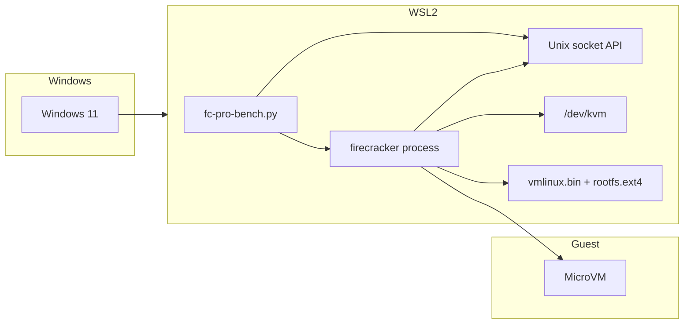
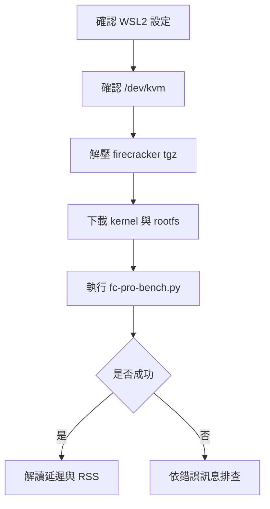

# WSL2 與 Firecracker 操作手冊

本文件是此專案的實作型操作手冊，內容已對齊目前實際存在的檔案與流程：

- `fc-pro-bench.py`：目前的主測試腳本
- `firecracker-v1.15.0-x86_64.tgz`：Firecracker 二進位檔發行包

本文聚焦在一件事：**如何在 WSL2 中把 Firecracker benchmark 跑起來，並知道每一步成功或失敗代表什麼。**

## TO-DO List

- 確認 WSL2 已啟用 `nestedVirtualization`
- 確認 `/dev/kvm` 存在且目前使用者可讀寫
- 解開 `firecracker-v1.15.0-x86_64.tgz` 並設定 `FC_BINARY`
- 準備 `vmlinux.bin` 與 `bionic.rootfs.ext4`，或設定 `KERNEL_PATH`、`ROOTFS_PATH`
- 使用 `uv run fc-pro-bench.py` 執行測試
- 依輸出檢查是環境問題、權限問題，還是成功進入 benchmark

## 快速開始

如果你只是要先跑通一次，可以直接照以下順序做。

### Step 1. 解開 Firecracker 發行包

```bash
cd /home/chad/firecracker-260312
wget https://github.com/firecracker-microvm/firecracker/releases/download/v1.15.0/firecracker-v1.15.0-x86_64.tgz
tar -xzf firecracker-v1.15.0-x86_64.tgz
chmod +x /home/chad/firecracker-260312/release-1.15.0-x86_64/firecracker-1.15.0-x86_64
export FC_BINARY=/home/chad/firecracker-260312/release-1.15.0-x86_64/firecracker-1.15.0-x86_64
```

### Step 2. 準備 kernel 與 rootfs

```bash
mkdir -p /tmp/firecracker-bench
cd /tmp/firecracker-bench
wget -O vmlinux.bin https://s3.amazonaws.com/spec.ccfc.min/img/quickstart_guide/x86_64/kernels/vmlinux.bin
wget -O bionic.rootfs.ext4 https://s3.amazonaws.com/spec.ccfc.min/img/quickstart_guide/x86_64/rootfs/bionic.rootfs.ext4
```

### Step 3. 確認 KVM

```bash
lsmod | rg kvm
ls -l /dev/kvm
[ -r /dev/kvm ] && [ -w /dev/kvm ] && echo "KVM_OK" || echo "KVM_FAIL"
```

### Step 4. 執行 benchmark

```bash
cd /home/chad/firecracker-260312
uv run fc-pro-bench.py
```

### Step 5. 成功判斷

若成功，應看到類似：

```text
📊 測試結果 (總耗時: ...)
平均啟動指令延遲: ... ms
P99 延遲: ... ms
總記憶體佔用 (RSS): ... MB
每個 VM 平均開銷: ... MB
✅ 測試完成，環境已清理。
```

若失敗，優先看以下三種錯誤：

- 找不到 `firecracker`
- 找不到 `vmlinux.bin` 或 `bionic.rootfs.ext4`
- `/dev/kvm` 權限不足或不存在

## 架構概覽



## 操作流程總覽



## 專案目前的測試方式

此專案使用 `fc-pro-bench.py` 進行併發測試。

`fc-pro-bench.py` 的流程如下：

1. 檢查 `firecracker` 二進位檔是否存在且可執行
2. 檢查 `/dev/kvm` 是否存在且有權限
3. 檢查 `kernel` 與 `rootfs` 是否存在
4. 啟動多個 Firecracker process
5. 透過 Unix socket API 依序送出：
   - `PUT /boot-source`
   - `PUT /drives/rootfs`
   - `PUT /actions` with `InstanceStart`
6. 收集延遲與 RSS 記憶體使用量
7. 輸出統計結果並清理 process / socket / log

## 前置條件

### 1. 確認 Python 與依賴

專案目前使用 `uv` 執行腳本，`pyproject.toml` 內已有：

- `aiohttp`
- `psutil`

若尚未建立環境，可先執行：

```bash
cd /home/chad/firecracker-260312
uv sync
```

### 2. WSL2 與 KVM

Firecracker 依賴 KVM，因此 WSL2 是否真的能提供可用的 `/dev/kvm` 是第一個關鍵。

Windows `%UserProfile%\.wslconfig` 至少需要：

```ini
[wsl2]
nestedVirtualization=true
```

設定後請在 PowerShell 執行：

```bash
wsl --shutdown
```

再重新開啟 WSL2。

### 3. 檢查 `/dev/kvm`

實際檢查指令可直接沿用 `快速開始` 的 Step 3。這一節只補充判讀與修正方式。

若權限不足，可加入 `kvm` 群組：

```bash
sudo usermod -aG kvm $USER
```

登出再登入後重試。

注意：即使 WSL2 啟用了 `nestedVirtualization`，不同主機與不同 WSL 版本下，`/dev/kvm` 仍可能不存在、不可用，或效能不穩定。因此 WSL2 數據比較適合拿來做「相對參考」，不適合直接當成正式生產基準。

### 4. Firecracker 二進位檔

專案中有 `firecracker-v1.15.0-x86_64.tgz`。它是 Firecracker 發行包，重點是提供 `firecracker` 可執行檔；它**不是** guest kernel，也**不是** rootfs。

解壓與 `FC_BINARY` 設定可直接沿用 `快速開始` 的 Step 1。

可用以下指令驗證：

```bash
$FC_BINARY --version
```

若能輸出版本資訊，代表二進位檔可正常執行。

### 5. Guest kernel 與 rootfs

Firecracker 還需要兩個檔案：

- `kernel`：例如 `vmlinux.bin`
- `rootfs`：例如 `bionic.rootfs.ext4`

目前腳本支援兩種來源：

- 預設位置：`/tmp/firecracker-bench/vmlinux.bin` 與 `/tmp/firecracker-bench/bionic.rootfs.ext4`
- 自訂位置：使用 `KERNEL_PATH`、`ROOTFS_PATH`

若要使用預設路徑，下載指令可直接沿用 `快速開始` 的 Step 2。

若要用自訂路徑，例如放在家目錄或其他磁碟，可改用：

```bash
export KERNEL_PATH=/absolute/path/to/vmlinux.bin
export ROOTFS_PATH=/absolute/path/to/bionic.rootfs.ext4
```

若不使用環境變數，則需把檔案放到：

```bash
/tmp/firecracker-bench/vmlinux.bin
/tmp/firecracker-bench/bionic.rootfs.ext4
```

可用以下方式確認檔案存在：

```bash
ls -lh /tmp/firecracker-bench/vmlinux.bin
ls -lh /tmp/firecracker-bench/bionic.rootfs.ext4
```

## 自訂路徑操作範例

若你不想把映像檔放在 `/tmp/firecracker-bench`，可以改成完整指定路徑。

若已準備好 `firecracker`、`kernel`、`rootfs`：

```bash
cd /home/chad/firecracker-260312
FC_BINARY=/absolute/path/to/firecracker \
KERNEL_PATH=/absolute/path/to/vmlinux.bin \
ROOTFS_PATH=/absolute/path/to/bionic.rootfs.ext4 \
uv run fc-pro-bench.py
```

## 腳本目前會檢查什麼

`fc-pro-bench.py` 已加入以下前置檢查：

- 找不到 `firecracker` 時，直接停止並提示如何設定 `FC_BINARY`
- 找不到 `kernel` / `rootfs` 時，直接停止並提示如何設定 `KERNEL_PATH`、`ROOTFS_PATH`
- `/dev/kvm` 不存在或不可存取時，直接停止並提示 WSL2 / 權限問題

另外，腳本現在只會清掉舊的 `socket` 與 `logs`，不會刪除整個 `/tmp/firecracker-bench`，避免把 `kernel` 與 `rootfs` 一起刪掉。

## 已出現的測試與錯誤紀錄

以下是目前專案操作過程中，實際發生過的情況。

### 1. 找不到 `firecracker` 二進位檔

現象：

```text
FileNotFoundError: [Errno 2] No such file or directory: './firecracker'
```

意義：

- 腳本原本預設執行 `./firecracker`
- 專案目錄當下沒有這個檔案

目前處理方式：

- 腳本已改為優先讀 `FC_BINARY`
- 若未設定，會嘗試從 `PATH` 找 `firecracker`
- 再找不到才退回 `./firecracker`

### 2. 找不到 kernel / rootfs

現象：

```text
Boot source error: The kernel file cannot be opened
Drive config error: ... /tmp/firecracker-bench/bionic.rootfs.ext4
```

意義：

- `firecracker` process 啟動了
- 但 API 設定階段找不到 `kernel_image_path` 或 `path_on_host`

目前處理方式：

- 腳本在正式啟動前就會先檢查檔案是否存在
- 若缺少，會直接退出，而不是等 50 個 VM 全部報錯後才看出原因

### 3. `/dev/kvm` 權限不足

現象：

```text
Start microvm error: Kvm error: Error creating KVM object: Permission denied (os error 13)
```

意義：

- `firecracker` process 與 API 設定都成功
- 但真正執行 `InstanceStart` 時無法建立 KVM 物件
- 這通常是 `/dev/kvm` 權限不足，或 WSL2 的 KVM 能力不完整

目前處理方式：

- 腳本在 benchmark 開始前就會檢查 `/dev/kvm`
- 若不可讀寫，會先中止並提示加群組或改在原生 Linux 執行

## 每一步該看到什麼

這一節用來快速判斷卡在哪一層。

| 步驟 | 成功時應看到 | 失敗時通常表示 |
| --- | --- | --- |
| 解壓 tgz | 有 `release-1.15.0-x86_64/firecracker-1.15.0-x86_64` | 發行包未解壓或路徑錯誤 |
| 執行 `$FC_BINARY --version` | 顯示版本資訊 | 二進位檔無法執行或權限錯誤 |
| 檢查 `ls -l /dev/kvm` | 裝置存在 | WSL2 / KVM 不可用 |
| 檢查 `[ -r /dev/kvm ] && [ -w /dev/kvm ]` | `KVM_OK` | 權限不足 |
| 檢查 `ls -lh /tmp/firecracker-bench/...` | 檔案存在 | kernel / rootfs 尚未下載 |
| 跑 `uv run fc-pro-bench.py` | 輸出統計指標 | 依錯誤訊息排查二進位檔、映像檔、KVM |

## 測試結果範例與說明

目前專案中的一次成功輸出如下：

```text
測試結果 (總耗時: 0.2410s)
平均啟動指令延遲: 141.50 ms
P99 延遲: 215.90 ms
總記憶體佔用 (RSS): 976.00 MB
每個 VM 平均開銷: 19.52 MB
```

這組數據可解讀為：

| 指標 | 數值 | 說明 |
| --- | ---: | --- |
| 總耗時 | `0.2410s` | 50 個 VM 完成 API 配置與 `InstanceStart` 這段 benchmark 的總牆鐘時間 |
| 平均啟動指令延遲 | `141.50 ms` | 平均每個 VM 在送出 `InstanceStart` 後，到 API 呼叫完成所花的時間 |
| P99 延遲 | `215.90 ms` | 最慢尾端 1% 的啟動指令延遲，反映高併發時的長尾抖動 |
| 總記憶體佔用 (RSS) | `976.00 MB` | 所有 Firecracker process 的 RSS 合計 |
| 每個 VM 平均開銷 | `19.52 MB` | `總 RSS / VM 數量`，用來估算每個 VM 平均需要多少宿主機實體記憶體 |

### 指標的真正含義

#### 平均啟動指令延遲

這不是「Guest 應用程式 ready」時間，而是 `PUT /actions` 中 `InstanceStart` 這個 API 呼叫本身的耗時平均值。

#### P99 延遲

這是尾延遲（Tail Latency）。若 P99 明顯高於平均值，代表高併發情境下，少數 VM 的啟動會明顯比較慢。

#### 總記憶體佔用 (RSS)

這裡統計的是 Firecracker process 的實體記憶體使用量總和，不是 guest 內部所有應用程式的完整工作集。

#### 每個 VM 平均開銷

這是估算密度的重要指標。若每個 VM 平均約 `19.52 MB`，則只看 Firecracker process 的 RSS，大致可用這個值推算擴展時的記憶體需求。

## 測試結果的限制

目前 `fc-pro-bench.py` 的輸出有幾個重要限制：

1. 它測的是 `InstanceStart` API 延遲，不是 guest service 的 ready time
2. 它沒有量測登入 guest、執行 workload、網路服務回應等 end-to-end 指標
3. 它量的是 Firecracker process 的 RSS，並非完整 guest workload 的實際總資源消耗
4. 在 WSL2 下，即使成功執行，數據仍可能受到宿主機排程、虛擬化層與背景工作干擾

因此，這份 benchmark 比較適合：

- 做環境可行性驗證
- 比較不同參數下的相對變化
- 找出明顯的配置錯誤或資源瓶頸

若要作為正式性能報告，建議最終仍在原生 Linux 上重跑一次。

## 參考

- [Firecracker GitHub](https://github.com/firecracker-microvm/firecracker)
- [Firecracker 官方網站](https://firecracker-microvm.github.io/)
- `fc-pro-bench.py`
