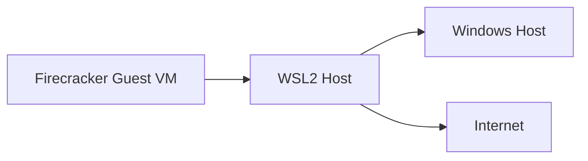
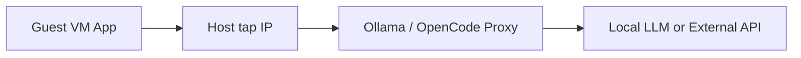
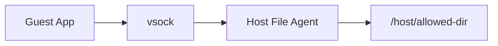
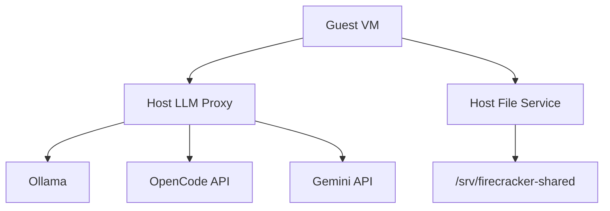

# Accessing hostOS APIs and files from VM
_Exported on 2026/3/13 at 16:30:21 [GMT+8] from Cursor (2.6.19)_

---

**User**

1. 如何在 vm 中可以呼叫外面 hostOS 中的 LLM (ollama 和 opencode API 和 gemini API)
2. 如何將在 vm 中可以存取外面 hostOS 中特定目錄下的檔案

---

**Cursor**

先看一下你目前這個 `Firecracker + WSL2` 環境的設定文件，確認網路與檔案共享的前提，再整理成可直接操作的做法。

我已先對齊你這個專案的實際架構：`Firecracker` 是跑在 `WSL2` 內，所以對 microVM 來說，真正的 host 是 `WSL2 Linux`，不是直接的 Windows。接下來我會用這個前提，把 `LLM API` 存取和 host 檔案共享拆成可落地的方案。

先釐清一個關鍵前提：對 `Firecracker microVM` 來說，真正的 host 是你現在跑 `Firecracker` 的那層 `WSL2 Linux`。若你的 `Ollama` 是跑在 Windows，而 `Firecracker` 跑在 WSL2，那路徑其實是：



所以你的問題可以拆成兩件事：

1. `Guest VM` 怎麼打到 `WSL2 host` 上的服務
2. `Guest VM` 怎麼安全地讀 `WSL2 host` 上特定目錄的檔案

## TO-DO List
- 確認 `microVM` 已有可用網路，能到 `WSL2 host` 的 `tap` IP
- 決定 `LLM` 要走 `TCP/HTTP proxy` 還是 `vsock proxy`
- 決定 host 檔案要用「只讀映像檔」、「檔案服務 API」或 `vsock file agent`
- 若要保護 API key，優先把 `Gemini API key` 留在 host，不直接放進 guest
- 只暴露白名單目錄，不要讓 guest 直接碰整個 host filesystem

## 先講結論

### 1. 在 VM 呼叫外面 hostOS 的 LLM
最實務的做法是：

- `Gemini API`：guest 直接走 internet 呼叫即可，只要 guest 有 egress network。
- `Ollama` / `OpenCode API`：不要讓 guest 直接找 `127.0.0.1`，而是讓 host 把服務綁在 `tap` IP，或由 host 開一個 proxy 給 guest 打。

### 2. 在 VM 存取 hostOS 特定目錄的檔案
`Firecracker` 不適合用 Docker 那種「直接 bind mount host directory」思維。它沒有成熟的原生 host directory sharing 機制可直接拿來當標準解法。實務上通常用這三種：

- 固定、只讀資料：做成額外 block device 掛進 guest
- 動態讀檔：host 開一個檔案服務 API 給 guest 存取
- 需要更嚴格控制：用 `vsock` 做 host-side file agent

## 一、LLM 存取方案

### 方案 A：用 host 網路 IP 暴露 HTTP API
這是最簡單、最容易落地的方式。

架構：



做法重點：

- host 端有一個 `tap` 介面，例如 `172.16.0.1`
- guest 端有 IP，例如 `172.16.0.2`
- guest 直接呼叫 `http://172.16.0.1:<port>`
- host 上的 `Ollama` 或 proxy 必須綁定在 `172.16.0.1` 或 `0.0.0.0`，不是只綁 `127.0.0.1`

範例：

```bash
# host 端
OLLAMA_HOST=172.16.0.1:11434 ollama serve
```

guest 內：

```bash
curl http://172.16.0.1:11434/api/tags
```

如果 `Ollama` 已經只跑在 host 的 `127.0.0.1:11434`，可以在 host 再加一層轉發：

```bash
socat TCP-LISTEN:11434,bind=172.16.0.1,fork TCP:127.0.0.1:11434
```

`OpenCode API` 也是同樣概念，只要它本質是 `HTTP API`，guest 就打 host 的 `tap IP + port`。

### 方案 B：`Gemini API` 直接從 guest 出網
如果你的 guest 已經能上網，`Gemini API` 最簡單就是直接呼叫官方 endpoint。

優點：

- 不需要 host 轉發
- 路徑最短

缺點：

- `API key` 會進 guest
- 若 guest 是不可信 workload，風險較高

適合情境：

- guest 是你自己控制的 app
- 沒有多租戶/隔離風險
- 你接受 key 存在 guest 裡

### 方案 C：host 端做統一 LLM gateway
這是我最推薦的架構，尤其你同時有 `Ollama`、`OpenCode API`、`Gemini API`。

做法：

- guest 只打 host 上一個統一入口，例如 `http://172.16.0.1:8080`
- host proxy 依路徑轉發到：
  - `Ollama`
  - `OpenCode API`
  - `Gemini API`
- 所有 token / key 都只留在 host

例如：

- `http://172.16.0.1:8080/ollama/...`
- `http://172.16.0.1:8080/opencode/...`
- `http://172.16.0.1:8080/gemini/...`

這樣 guest 不知道真正憑證，也比較好做：

- 白名單模型
- rate limit
- request/response logging
- access control

### 方案 D：用 `vsock`，不要走 TCP
如果你不想把 host service 暴露到網路介面，`vsock` 是更乾淨的 host-guest 通道。

適合：

- 只要 host 與 guest 通訊
- 不想開 `tap` 上的 HTTP port
- 想把 attack surface 壓小

但缺點也很明顯：

- 一般 `curl` / SDK 不能直接無痛用
- 通常要自己做一個 `vsock <-> HTTP` bridge
- 落地複雜度比 TCP 高

所以如果你現在目標是「先能用」，先選 `方案 A` 或 `方案 C`。

## 二、host 檔案存取方案

### 先講限制
如果你問的是像 Docker 那樣：

- host 有 `/data/prompts`
- guest 直接 mount 成 `/mnt/prompts`

在 `Firecracker` 上，這不是最順手的標準做法。不要把它當成現成有的能力。

### 方案 1：把特定目錄做成只讀磁碟映像
如果那批檔案更新不頻繁，這是最穩的方式。

做法：

- 在 host 把指定目錄打包成 `ext4` 或 `squashfs` 映像
- 當成第二顆 block device 掛進 microVM
- guest 開機後 mount 成例如 `/mnt/shared`

適合：

- prompt templates
- 模型設定檔
- 基準測試資料集
- 幾乎不變的 assets

優點：

- 最接近 Firecracker 設計哲學
- 簡單、穩定、隔離清楚

缺點：

- 更新內容要重建映像
- 不適合高頻率雙向寫入

### 方案 2：host 開檔案服務 API
如果你要的是「guest 可以讀 host 某個白名單目錄內的檔案」，這通常是最實用的方案。

例如 host 開一個小服務，只允許讀：

- `/srv/shared/prompts`
- `/srv/shared/input`

guest 透過 HTTP API 做：

- `GET /files/prompts/a.txt`
- `GET /files/input/job-001.json`
- `PUT /files/output/result.json`

優點：

- 權限好控
- 不需要 guest 直接 mount host filesystem
- 容易加驗證、審計、白名單

缺點：

- 你要自己定 API
- 不像本地檔案系統那麼透明

如果你的 guest 只是 app，不是要 shell 裡面到處 `ls/cp/vim`，這是最好的折衷。

### 方案 3：用 `vsock file agent`
這是安全版的檔案代理。

架構：



host agent 只接受有限操作，例如：

- `read(path)`
- `list(path)`
- `write(path)`
- `stat(path)`

而且 `path` 只能在白名單根目錄下。

優點：

- 不經過一般 TCP port
- 攻擊面較小
- 適合敏感環境

缺點：

- 開發成本比 HTTP 高
- 除錯也比較麻煩

### 方案 4：用 SSH/SFTP/NFS 類檔案服務
也可行，但我不會列為第一選擇。

原因：

- 對 `microVM` 來說偏重
- 權限收斂沒那麼精準
- 你只是要「特定目錄存取」時，通常 HTTP API / vsock agent 更乾淨

## 我的建議
如果你現在要的是「先能跑，再逐步收斂安全性」，建議這樣選：

### LLM
- `Ollama` / `OpenCode API`：先用 `host tap IP + HTTP proxy`
- `Gemini API`：若重視 key 保護，也走同一個 host proxy；若只是快速驗證，可先 guest 直連官方 API

### 檔案
- 靜態檔案：用額外 block device
- 動態檔案：用 host file service API
- 高安全需求：再升級成 `vsock agent`

## 最小可行架構
你可以直接把系統收斂成下面這個樣子：



這樣 guest 只需要知道兩個 endpoint：

- `http://172.16.0.1:8080`：LLM gateway
- `http://172.16.0.1:8081`：檔案服務

其餘憑證、真實路徑、模型選擇、rate limit 都留在 host。

## 你這個環境的特別提醒
因為你目前是 `Windows -> WSL2 -> Firecracker guest` 三層結構：

- 若 `Ollama` 跑在 Windows，不建議讓 guest 直接找 Windows IP
- 比較穩的做法是：先在 `WSL2 host` 開 proxy，再由 proxy 去打 Windows 上的 `Ollama`
- 對 `Firecracker guest` 而言，只看見 `WSL2 host tap IP`

這樣網路拓樸最單純，也比較好除錯。

## 一句話版本
- `LLM`：用 `WSL2 host` 當 gateway，guest 只打 host 的固定 IP/port
- `檔案`：不要期待直接 bind mount host 目錄，改用「block device」或「host file service / vsock agent」

如果你要，我下一步可以直接幫你補一版「可落地 Implementation Plan」，內容包含：
1. `Firecracker tap network` 配置
2. `host LLM proxy` 範例
3. `host file service` 範例
4. guest 內怎麼呼叫這兩個服務
