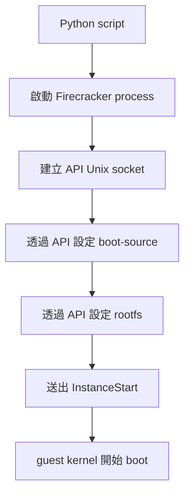
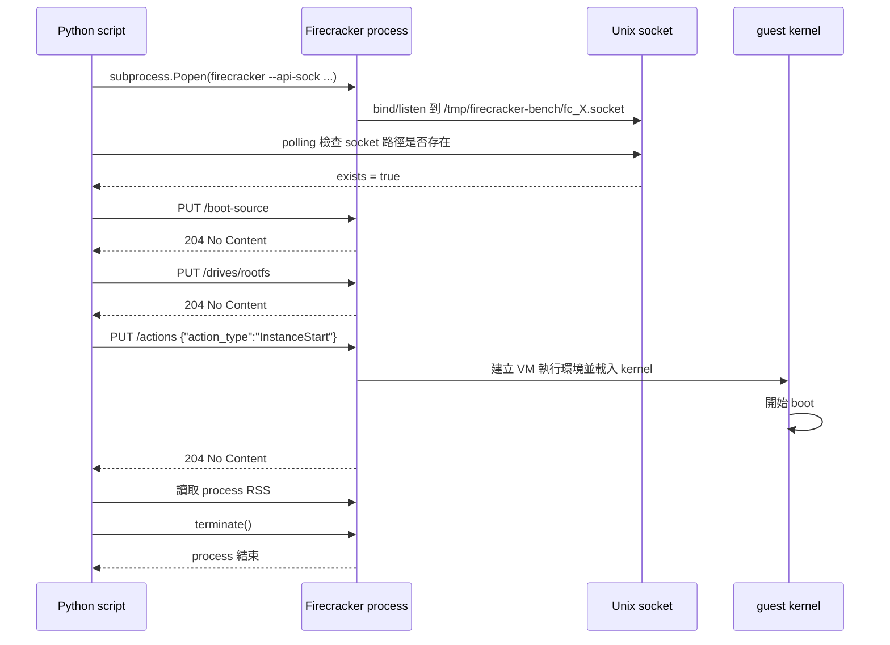

# Program behavior explanation for fc-pro-bench.py
_Exported on 2026/3/13 at 16:07:20 [GMT+8] from Cursor (2.6.19)_

---

**User**

@fc-pro-bench.py 請依步驟(step.1~n)詳細說明程式行為

---

**Cursor**

先讀 `fc-pro-bench.py`，我會先做由上而下的流程拆解，再按 `step.1 ~ n` 說明每段程式實際會做什麼。

## Top-down Overview

`fc-pro-bench.py` 是一支用來做 **Firecracker MicroVM 併發啟動 benchmark** 的腳本。它的主流程很單純：

1. 檢查執行條件是否齊備
2. 清理暫存環境
3. 併發啟動多個 Firecracker process
4. 透過 Firecracker API 設定每台 VM
5. 送出 `InstanceStart` 啟動 VM
6. 收集延遲與記憶體資料
7. 輸出統計結果後關閉所有 process

核心入口在這段：

```193:195:fc-pro-bench.py
if __name__ == "__main__":
    # 注意：請確保當前目錄有 firecracker 二進位檔
    asyncio.run(run_benchmark())
```

---

## Step.1 初始化全域設定

程式一開始先定義 benchmark 的固定參數：

```13:22:fc-pro-bench.py
# --- 實驗室配置 (Industrial Standard Configuration) ---
VM_COUNT = 50  # 初始測試建議 50，隨後挑戰 1000
BASE_DIR = Path("/tmp/firecracker-bench")
# 優先：環境變數 FC_BINARY → PATH 中的 firecracker → 當前目錄 ./firecracker
FC_BINARY = os.environ.get("FC_BINARY") or shutil.which("firecracker") or "./firecracker"
FC_BINARY = Path(FC_BINARY).resolve() if FC_BINARY else None
# Kernel / RootFS：可透過 KERNEL_PATH、ROOTFS_PATH 指定，否則使用 BASE_DIR 內預設檔名
KERNEL = Path(os.environ["KERNEL_PATH"]) if os.environ.get("KERNEL_PATH") else BASE_DIR / "vmlinux.bin"
ROOTFS = Path(os.environ["ROOTFS_PATH"]) if os.environ.get("ROOTFS_PATH") else BASE_DIR / "bionic.rootfs.ext4"
LOG_DIR = BASE_DIR / "logs"
```

這一步的行為是：

- `VM_COUNT = 50`：預設一次要測 50 台 MicroVM。
- `BASE_DIR`：所有 socket、log、預設 kernel/rootfs 都放在 `/tmp/firecracker-bench`。
- `FC_BINARY`：依序從以下來源找 Firecracker binary。
  1. 環境變數 `FC_BINARY`
  2. 系統 `PATH`
  3. 目前目錄的 `./firecracker`
- `KERNEL`、`ROOTFS`：可用環境變數覆蓋，否則使用 `BASE_DIR` 下的預設檔名。

也就是說，這支程式的執行環境是「可配置，但有預設值」。

---

## Step.2 建立單一 VM 的抽象物件

`FirecrackerInstance` 代表「一台要被啟動與測量的 VM」。

```25:31:fc-pro-bench.py
class FirecrackerInstance:
    def __init__(self, vm_id):
        self.vm_id = vm_id
        self.socket_path = BASE_DIR / f"fc_{vm_id}.socket"
        self.log_path = LOG_DIR / f"fc_{vm_id}.log"
        self.process = None
        self.metrics = {}
```

每個 instance 會保存：

- `vm_id`：VM 編號
- `socket_path`：Firecracker API 的 Unix socket 路徑
- `log_path`：預留的 log 路徑
- `process`：對應的 Firecracker 子行程
- `metrics`：後續收集的效能資料

重點是：**每一台 VM 都有自己獨立的 Unix socket**，程式就是透過這個 socket 對該 VM 發 API 指令。

---

## Step.3 啟動 Firecracker process

當 `run_benchmark()` 建立好多個 `FirecrackerInstance` 後，會呼叫每個 instance 的 `start_process()`。

```33:45:fc-pro-bench.py
async def start_process(self):
    """啟動 Firecracker 守護進程 [cite: 1]"""
    if self.socket_path.exists():
        self.socket_path.unlink()

    # 頂尖思維：使用 taskset 進行 CPU 綁定，減少 Context Switch 噪聲
    # 這裡簡單示範啟動命令
    cmd = [str(FC_BINARY), "--api-sock", str(self.socket_path), "--id", str(self.vm_id)]
    self.process = subprocess.Popen(cmd, stdout=subprocess.DEVNULL, stderr=subprocess.DEVNULL)

    # 等待 Socket 建立
    while not self.socket_path.exists():
        await asyncio.sleep(0.01)
```

這一步實際做的事：

1. 如果舊 socket 檔還在，先刪掉，避免殘留狀態。
2. 用 `subprocess.Popen(...)` 啟動 Firecracker。
3. 啟動參數只有最基本的：
   - `--api-sock`
   - `--id`
4. `stdout/stderr` 都丟到 `DEVNULL`，所以預設不會在終端看到 Firecracker 輸出。
5. 之後進入 polling，等 socket 檔真的出現，表示 Firecracker API server 已可接受連線。

這裡要注意的是：**這一步只是在啟動 Firecracker VMM process，還沒有讓 guest kernel 開始 boot**。真正啟動 VM 是後面的 `InstanceStart`。

---

## Step.4 執行啟動前檢查

在正式 benchmark 前，`run_benchmark()` 會先做三個檢查：

```147:150:fc-pro-bench.py
async def run_benchmark():
    _check_firecracker_binary()
    _check_kvm_access()
    _check_kernel_rootfs()
```

### Step.4.1 檢查 Firecracker binary

`_check_firecracker_binary()` 確保：

- `FC_BINARY` 有找到
- 檔案存在
- 檔案具有可執行權限

若失敗，直接 `SystemExit` 結束程式。

### Step.4.2 檢查 `/dev/kvm`

`_check_kvm_access()` 確保：

- 系統有 `/dev/kvm`
- 目前使用者有讀寫權限

如果是在 WSL2，這一步通常就會失敗，因為註解已明講 **WSL2 不支援 nested virtualization**，因此無法跑 Firecracker。

### Step.4.3 檢查 kernel 與 rootfs

`_check_kernel_rootfs()` 確保：

- `KERNEL` 檔案存在
- `ROOTFS` 檔案存在

若缺檔，會提示你用預設位置放檔，或用 `KERNEL_PATH` / `ROOTFS_PATH` 指定。

---

## Step.5 清理 benchmark 環境

這一步是 `run_benchmark()` 裡面真正的 Step 1：

```151:159:fc-pro-bench.py
# --- Step 1: 環境預熱與清理（只清 socket/log，保留 kernel 與 rootfs）---
print("🧹 初始化 tmpfs 環境...")
BASE_DIR.mkdir(parents=True, exist_ok=True)
LOG_DIR.mkdir(parents=True, exist_ok=True)
for p in BASE_DIR.glob("fc_*.socket"):
    p.unlink(missing_ok=True)
for p in LOG_DIR.glob("fc_*.log"):
    p.unlink(missing_ok=True)
print(f"🚀 正在併發啟動 {VM_COUNT} 個 MicroVM...")
```

行為如下：

- 建立工作目錄與 log 目錄
- 刪除舊的 `fc_*.socket`
- 刪除舊的 `fc_*.log`
- **不會刪掉** `vmlinux.bin` 和 `bionic.rootfs.ext4`

這代表程式把 kernel/rootfs 視為「測試資產」，而 socket/log 視為「一次性 runtime artifact」。

---

## Step.6 建立所有 VM instance

```161:161:fc-pro-bench.py
instances = [FirecrackerInstance(i) for i in range(VM_COUNT)]
```

這會建立 `0 ~ 49` 共 50 個 `FirecrackerInstance`。

也就是說，從這一步開始，程式在記憶體裡準備好了 50 個 VM 的控制物件，但還沒全部完成配置。

---

## Step.7 批量啟動所有 Firecracker process

這是註解中的 Step 2：

```163:165:fc-pro-bench.py
# --- Step 2: 批量啟動進程 ---
await asyncio.gather(*(inst.start_process() for inst in instances))
```

這裡的重點是 `asyncio.gather(...)`：

- 所有 VM 的 `start_process()` 會**併發**執行
- 不是一台一台串行啟動
- 只要某台 socket 還沒建立，它就會在自己的 coroutine 內短暫 sleep
- 最終要等到全部 VM 的 API socket 都 ready，這一步才結束

所以 Step 2 的完成條件不是「process 已經 fork 出來」，而是更嚴格的「每台 VM 的 Firecracker API socket 都可用了」。

---

## Step.8 併發做 API 配置並啟動 VM

這是整支程式最核心的 benchmark 區段：

```166:170:fc-pro-bench.py
# --- Step 3: 批量 API 配置 (核心測試段) ---
start_bench = time.perf_counter()
async with aiohttp.ClientSession() as session:
    await asyncio.gather(*(inst.configure_and_run(session) for inst in instances))
end_bench = time.perf_counter()
```

這一步量測的是：

- 從開始對所有 VM 下 API 設定命令
- 到所有 VM 都完成 `configure_and_run()`

也就是「大規模併發配置與發射」的總時間。

---

## Step.9 每台 VM 的 API 配置流程

每個 instance 在 `configure_and_run()` 內都會做 3 個 API 動作：

```47:78:fc-pro-bench.py
async def configure_and_run(self, session):
    """執行 API 配置流程"""
    start_ts = time.perf_counter()

    # 1. 配置內核 (Boot Source)
    await self.api_put(
        session,
        "/boot-source",
        {
            "kernel_image_path": str(KERNEL),
            "boot_args": "console=ttyS0 reboot=k panic=1 pci=off",
        },
    )

    # 2. 配置磁碟 (RootFS)
    await self.api_put(
        session,
        "/drives/rootfs",
        {
            "drive_id": "rootfs",
            "path_on_host": str(ROOTFS),
            "is_root_device": True,
            "is_read_only": True,  # 唯讀模式效能更佳
        },
    )

    # 3. 發射 (Launch)
    launch_ts = time.perf_counter()
    await self.api_put(session, "/actions", {"action_type": "InstanceStart"})

    self.metrics["api_latency_ms"] = (launch_ts - start_ts) * 1000
    self.metrics["boot_command_ms"] = (time.perf_counter() - launch_ts) * 1000
```

### Step.9.1 設定 boot source

呼叫 `PUT /boot-source`，把 kernel 路徑與 boot args 傳給 Firecracker。

boot args 包含：

- `console=ttyS0`：console 輸出到 serial
- `reboot=k`
- `panic=1`
- `pci=off`

這些是常見的 Firecracker/輕量 VM 啟動參數。

### Step.9.2 設定 rootfs

呼叫 `PUT /drives/rootfs`，掛載 root disk。

設定內容表示：

- 這顆磁碟的 ID 是 `rootfs`
- 主機檔案路徑是 `ROOTFS`
- 它是 root device
- 以唯讀方式掛載

`is_read_only=True` 通常能降低寫入干擾，對 benchmark 比較乾淨。

### Step.9.3 送出啟動命令

呼叫 `PUT /actions`，body 是：

```json
{"action_type": "InstanceStart"}
```

這才是真正讓 Firecracker 啟動 guest VM 的關鍵命令。

### Step.9.4 記錄延遲

它記兩個時間：

- `api_latency_ms`：從開始配置到送出啟動命令前的時間
- `boot_command_ms`：送出 `InstanceStart` 後，到 API call 返回的時間

注意：這裡的 `boot_command_ms` **不是「guest OS 完整開機時間」**，而比較像「Firecracker 接受啟動命令並返回」的耗時。

---

## Step.10 實際送 API 的方式

所有 API request 都走 `api_put()`：

```80:85:fc-pro-bench.py
async def api_put(self, session, path, data):
    connector = aiohttp.UnixConnector(path=str(self.socket_path))
    async with aiohttp.ClientSession(connector=connector) as s:
        async with s.put(f"http://localhost{path}", json=data) as resp:
            if resp.status != 204:
                print(f"Error VM {self.vm_id}: {await resp.text()}")
```

這段的程式行為是：

- 對每台 VM 的 Unix socket 建立一個 `aiohttp.UnixConnector`
- 用 `http://localhost/...` 形式發 HTTP PUT
- 底層其實不是走 TCP，而是走 Unix domain socket
- 如果 Firecracker 回的 status 不是 `204 No Content`，就印錯誤內容

這裡有一個值得注意的實作細節：

- `configure_and_run(self, session)` 雖然接收了 `session`
- 但 `api_put()` 內部**沒有使用傳進來的 `session`**
- 而是每次 API 呼叫都新建一個 `ClientSession`

所以表面上看起來像共用 session，實際上沒有共用。這會增加一些額外 overhead。

---

## Step.11 收集記憶體使用量

當全部 VM 都完成配置與 `InstanceStart` 後，程式做 Step 4：

```172:175:fc-pro-bench.py
# --- Step 4: 資源觀測 (RSS 記憶體) ---
total_rss = sum(
    psutil.Process(inst.process.pid).memory_info().rss for inst in instances if inst.process
)
```

這一步會：

- 逐一取得每個 Firecracker process 的 PID
- 用 `psutil` 讀取它的 `rss`
- 將所有 RSS 相加

`RSS` 是 resident set size，也就是目前實際駐留在實體記憶體中的用量。

這裡量到的是 **Firecracker process 的宿主機記憶體佔用**，不是 guest 裡面 `free -m` 看到的值。

---

## Step.12 計算延遲統計

Step 5 會整理剛才每台 VM 的 `boot_command_ms`：

```177:185:fc-pro-bench.py
# --- Step 5: 數據分析 ---
latencies = [inst.metrics["boot_command_ms"] for inst in instances]
print("\n" + "=" * 40)
print(f"📊 測試結果 (總耗時: {end_bench - start_bench:.4f}s)")
print(f"平均啟動指令延遲: {statistics.mean(latencies):.2f} ms")
print(f"P99 延遲: {statistics.quantiles(latencies, n=100)[98]:.2f} ms")
print(f"總記憶體佔用 (RSS): {total_rss / 1024 / 1024:.2f} MB")
print(f"每個 VM 平均開銷: {(total_rss / VM_COUNT) / 1024 / 1024:.2f} MB")
print("=" * 40)
```

輸出的統計意義如下：

- `總耗時`：所有 VM 併發配置與啟動命令完成的牆鐘時間
- `平均啟動指令延遲`：所有 `boot_command_ms` 的平均值
- `P99 延遲`：99th percentile，觀察尾延遲
- `總記憶體佔用 (RSS)`：所有 Firecracker process 的 RSS 總和
- `每個 VM 平均開銷`：平均每台 VM 對宿主機佔多少記憶體

---

## Step.13 關閉所有 Firecracker process

最後 Step 6 做清理：

```187:190:fc-pro-bench.py
# --- Step 6: 優雅清理 ---
for inst in instances:
    inst.stop()
print("✅ 測試完成，環境已清理。")
```

`stop()` 的行為很直接：

```87:90:fc-pro-bench.py
def stop(self):
    if self.process:
        self.process.terminate()
        self.process.wait()
```

也就是：

- 對每個 Firecracker process 發 `SIGTERM`
- 等待它結束

因此整體 benchmark 結束後，不會保留這批 Firecracker 行程。

---

## 一句話總結

這支程式本質上是在測：

**同時建立大量 Firecracker VMM process，並以 Unix socket 併發下發 boot-source、rootfs、InstanceStart 指令時，整體延遲與宿主機 RSS 成本如何。**

如果你要，我下一步可以幫你再補一版：

1. `step.1 ~ n` 對照「實際終端輸出」版  
2. `step.1 ~ n` 對照「時序圖 Mermaid」版  
3. 標出這支程式目前的設計缺點與可能失真的 benchmark 點

---

**User**

1. 什麼是 Firecracker API 的 Unix socket 路徑? Unix socket 是什麼 ?
2. "進入 polling，等 socket 檔真的出現"。 socket 檔如何產生?
3. "啟動 Firecracker VMM process" 與 "讓 guest kernel 開始 boot" 有何不同?

---

**Cursor**

## 1. 什麼是 Firecracker API 的 Unix socket 路徑？Unix socket 是什麼？

先拆成兩層來看。

### Unix socket 是什麼
`Unix socket` 是一種 **同一台主機內部行程間通訊（IPC, Inter-Process Communication）** 的方式。  
它和一般常見的 TCP socket 很像，差別在於：

- TCP socket 透過 `IP:Port` 通訊，例如 `127.0.0.1:8080`
- Unix socket 透過 **檔案系統中的一個路徑** 通訊，例如 `/tmp/firecracker-bench/fc_0.socket`

也就是說，Unix socket 不走網路卡、不經過 TCP/IP stack，而是直接在本機 kernel 內處理，所以通常：

- 延遲更低
- 權限控制更直接
- 適合只需要本機通訊的服務

### Firecracker API 的 Unix socket 路徑是什麼
在這支程式中，每台 Firecracker 都會開一個 API server，讓外部程式可以送 HTTP request 給它。  
但這個 HTTP 不是走 TCP port，而是綁在 Unix socket 上。

例如這段：

```6:10:fc-pro-bench.py
self.vm_id = vm_id
self.socket_path = BASE_DIR / f"fc_{vm_id}.socket"
self.log_path = LOG_DIR / f"fc_{vm_id}.log"
self.process = None
self.metrics = {}
```

如果 `vm_id = 0`，那它的 API socket 路徑就是：

```text
/tmp/firecracker-bench/fc_0.socket
```

之後程式會用這個路徑連到 Firecracker：

```80:84:fc-pro-bench.py
async def api_put(self, session, path, data):
    connector = aiohttp.UnixConnector(path=str(self.socket_path))
    async with aiohttp.ClientSession(connector=connector) as s:
        async with s.put(f"http://localhost{path}", json=data) as resp:
```

重點是：

- `self.socket_path` 是 Firecracker API 的「入口」
- 外部程式不是連 `localhost:某個 port`
- 而是連這個 `.socket` 檔對應的 Unix domain socket

你可以把它想成：

- TCP world：`http://127.0.0.1:8080`
- Unix socket world：`http://localhost/...` + `connector 指向 /tmp/xxx.socket`

其中真正決定連線目的地的是 `UnixConnector(path=...)`。

---

## 2. 「進入 polling，等 socket 檔真的出現」。socket 檔如何產生？

它不是 Python 程式自己 `touch` 出來的，也不是一般文字檔。  
**是 Firecracker process 啟動後，主動向 Linux kernel 要求建立並綁定的 Unix socket endpoint。**

這段是關鍵：

```38:45:fc-pro-bench.py
# 頂尖思維：使用 taskset 進行 CPU 綁定，減少 Context Switch 噪聲
# 這裡簡單示範啟動命令
cmd = [str(FC_BINARY), "--api-sock", str(self.socket_path), "--id", str(self.vm_id)]
self.process = subprocess.Popen(cmd, stdout=subprocess.DEVNULL, stderr=subprocess.DEVNULL)

# 等待 Socket 建立
while not self.socket_path.exists():
    await asyncio.sleep(0.01)
```

### 實際流程
1. Python 用 `subprocess.Popen(...)` 啟動 Firecracker。
2. Firecracker 看到參數 `--api-sock /tmp/firecracker-bench/fc_0.socket`
3. Firecracker 內部呼叫作業系統相關 API，大致流程概念會是：
   - `socket(AF_UNIX, ...)`
   - `bind("/tmp/firecracker-bench/fc_0.socket")`
   - `listen(...)`
4. Linux kernel 在檔案系統上建立一個 **socket 型別的特殊檔案**
5. 所以 `Path.exists()` 會變成 `True`
6. Python 端因此知道：「這個 Firecracker 的 API 現在可以連了」

### 為什麼程式要 polling
因為 `Popen()` 只代表「子行程已經被啟動」，**不保證它已經完成 API socket 的 bind/listen**。

所以這裡要一直檢查：

- socket 檔是否已出現
- 若還沒出現，sleep 10ms 再看一次

這就是 polling。

### 補充
這個 `.socket` 路徑看起來像普通檔案，但其實不是普通資料檔，而是 Unix domain socket 的檔案節點。  
用 `ls -l` 看時，通常前面的型別會顯示成 `s`，不是 `-`。

---

## 3. 「啟動 Firecracker VMM process」與「讓 guest kernel 開始 boot」有何不同？

這是這支程式最重要的觀念之一。兩者不是同一件事。

### 先講結論
- **啟動 Firecracker VMM process**：是把 Firecracker 這個虛擬機管理程式本身跑起來
- **讓 guest kernel 開始 boot**：是告訴 Firecracker「現在可以啟動裡面的那台 VM 了」

也就是：

- 前者是啟動「管理者」
- 後者是啟動「被管理的 guest OS」

---

## 觀念圖



---

## 3.1 啟動 Firecracker VMM process 是什麼意思？

這一步對應 `start_process()`：

```40:45:fc-pro-bench.py
cmd = [str(FC_BINARY), "--api-sock", str(self.socket_path), "--id", str(self.vm_id)]
self.process = subprocess.Popen(cmd, stdout=subprocess.DEVNULL, stderr=subprocess.DEVNULL)

# 等待 Socket 建立
while not self.socket_path.exists():
    await asyncio.sleep(0.01)
```

此時發生的是：

- Linux 啟動一個 Firecracker 行程
- 這個行程建立自己的 API socket
- 它進入「等待配置」狀態

此時 **guest VM 還沒開始跑**，原因是：

- kernel 還沒透過 API 指定完整 boot source
- rootfs 還沒掛進來
- 也還沒收到 `InstanceStart`

所以這個階段比較像：

- VMM 已經上線
- 控制介面已經 ready
- 但 VM 還沒按下電源鍵

---

## 3.2 讓 guest kernel 開始 boot 是什麼意思？

這一步發生在 `configure_and_run()` 裡的最後：

```73:78:fc-pro-bench.py
# 3. 發射 (Launch)
launch_ts = time.perf_counter()
await self.api_put(session, "/actions", {"action_type": "InstanceStart"})

self.metrics["api_latency_ms"] = (launch_ts - start_ts) * 1000
self.metrics["boot_command_ms"] = (time.perf_counter() - launch_ts) * 1000
```

在這之前，程式已經先做：

- `PUT /boot-source`
- `PUT /drives/rootfs`

也就是把：

- guest 要用哪個 kernel
- guest 要掛哪個 rootfs

都先告訴 Firecracker。

等到 `InstanceStart` 一送出，Firecracker 才會真正開始：

- 建立 VM 執行環境
- 將 vCPU 跑起來
- 載入 guest kernel
- 讓 kernel 進入 boot 流程
- 開始初始化 guest OS

這才叫 **guest kernel 開始 boot**。

---

## 3.3 為什麼要分兩段？

因為 Firecracker 的設計就是：

1. 先啟動 VMM
2. 透過 API 做完整配置
3. 最後再明確送 `InstanceStart`

這種設計有幾個好處：

- 啟動前可以把 VM 設定準備完整
- 配置流程可程式化、自動化
- 容易做 benchmark 與批量控制
- 能明確區分「管理面 ready」與「guest 開始執行」

---

## 3.4 用一個直覺比喻

可以把它想成一台新電腦：

- **啟動 Firecracker VMM process**  
  像是你把主機板、電源管理、BIOS 控制器都準備好了，控制台可操作了

- **讓 guest kernel 開始 boot**  
  像是你真的按下電源，開始載入作業系統

所以兩者差別在於：

- 第一階段是「虛擬機管理程式活著」
- 第二階段是「虛擬機裡的作業系統開始跑」

---

## TO-DO List

如果你要繼續往下理解這支程式，建議下一步看這 3 個點：

- 釐清 `api_put()` 為什麼沒有使用傳入的 `session`，而是每次重建 `ClientSession`
- 釐清 `boot_command_ms` 量到的是 API 返回時間，不是完整 guest boot 完成時間
- 釐清目前程式沒有檢查 guest 是否真的進入 usable state，只是送出 `InstanceStart` 成功而已

如果你要，我可以下一段直接幫你畫一張 `fc-pro-bench.py` 的 **完整時序圖（Mermaid sequenceDiagram）**，把 `Python / Firecracker process / Unix socket / guest kernel` 四者關係一次講清楚。

---

**User**

繼續

---

**Cursor**

## 時序圖

下面用 `Python script / Firecracker process / Unix socket / guest kernel` 四個角色，串起這支程式真正的執行順序。



---

## 由上而下再看一次

這支程式其實可以拆成兩個世界：

### 控制面（Control Plane）
也就是 Python script 在做的事：

- 啟動 Firecracker process
- 等 API socket ready
- 送 API 設定
- 收集 latency / RSS
- 結束 process

### 資料面 / 執行面（Execution Plane）
也就是 Firecracker 與 guest OS 在做的事：

- Firecracker 接受 API 設定
- 建立 VM 執行環境
- 載入 kernel 與 rootfs
- 讓 guest kernel 開始 boot

這兩層一定要分開理解，否則很容易誤以為：

- `Popen()` = VM 已經開機  
其實不是
- `InstanceStart` 回 204 = guest OS 已完全可用  
其實也不是

---

## 關鍵細節 1：`socket 檔出現` 只代表 API ready

當這段成立時：

```33:45:fc-pro-bench.py
async def start_process(self):
    """啟動 Firecracker 守護進程 [cite: 1]"""
    if self.socket_path.exists():
        self.socket_path.unlink()

    # 頂尖思維：使用 taskset 進行 CPU 綁定，減少 Context Switch 噪聲
    # 這裡簡單示範啟動命令
    cmd = [str(FC_BINARY), "--api-sock", str(self.socket_path), "--id", str(self.vm_id)]
    self.process = subprocess.Popen(cmd, stdout=subprocess.DEVNULL, stderr=subprocess.DEVNULL)

    # 等待 Socket 建立
    while not self.socket_path.exists():
        await asyncio.sleep(0.01)
```

只能保證一件事：

- Firecracker 的 API server 已經把 Unix socket 建好了

**不能保證**：

- kernel 已載入
- rootfs 已配置
- guest 已 boot
- guest 可接受登入或網路流量

所以 `start_process()` 完成後，狀態應理解為：

- `Firecracker ready for configuration`
- 不是 `VM boot completed`

---

## 關鍵細節 2：`InstanceStart` 才是開機觸發點

真正讓 guest 啟動的是這段：

```73:75:fc-pro-bench.py
# 3. 發射 (Launch)
launch_ts = time.perf_counter()
await self.api_put(session, "/actions", {"action_type": "InstanceStart"})
```

在這之前的 `/boot-source` 與 `/drives/rootfs` 都只是「準備開機參數」：

- `/boot-source`：指定拿哪個 kernel 開
- `/drives/rootfs`：指定 root filesystem 在哪裡

這很像：

- 先把 BIOS 開機順序設好
- 先把硬碟插好
- 最後才真的按 power on

---

## 關鍵細節 3：這支 benchmark 量到的是哪一段時間？

目前主要量兩種時間：

```47:78:fc-pro-bench.py
async def configure_and_run(self, session):
    """執行 API 配置流程"""
    start_ts = time.perf_counter()

    # 1. 配置內核 (Boot Source)
    await self.api_put(
        session,
        "/boot-source",
        {
            "kernel_image_path": str(KERNEL),
            "boot_args": "console=ttyS0 reboot=k panic=1 pci=off",
        },
    )

    # 2. 配置磁碟 (RootFS)
    await self.api_put(
        session,
        "/drives/rootfs",
        {
            "drive_id": "rootfs",
            "path_on_host": str(ROOTFS),
            "is_root_device": True,
            "is_read_only": True,  # 唯讀模式效能更佳
        },
    )

    # 3. 發射 (Launch)
    launch_ts = time.perf_counter()
    await self.api_put(session, "/actions", {"action_type": "InstanceStart"})

    self.metrics["api_latency_ms"] = (launch_ts - start_ts) * 1000
    self.metrics["boot_command_ms"] = (time.perf_counter() - launch_ts) * 1000
```

### `api_latency_ms`
代表：

- 從開始設定
- 到送出 `InstanceStart` 之前

也就是「前置 API 配置成本」。

### `boot_command_ms`
代表：

- `PUT /actions` 送出去
- 到 Firecracker 回 HTTP response

也就是「啟動命令 API 的處理時間」。

### 它沒有量到的東西
它沒有直接量到：

- guest kernel 完整 boot 完成時間
- init/systemd 啟動完成時間
- rootfs mount 完成後使用者空間是否 ready
- SSH / console / app service 是否真的可用

所以這支程式的 benchmark 比較準確的名稱應該是：

- **Firecracker API start path latency benchmark**
- 而不是完整的 **guest boot-to-ready benchmark**

---

## 關鍵細節 4：為什麼 `204` 不代表 VM 已完全 usable？

在 `api_put()` 裡：

```80:85:fc-pro-bench.py
async def api_put(self, session, path, data):
    connector = aiohttp.UnixConnector(path=str(self.socket_path))
    async with aiohttp.ClientSession(connector=connector) as s:
        async with s.put(f"http://localhost{path}", json=data) as resp:
            if resp.status != 204:
                print(f"Error VM {self.vm_id}: {await resp.text()}")
```

如果 `resp.status == 204`，代表的是：

- Firecracker API 成功接受並處理了該 request

不代表：

- guest 已進入 login prompt
- 檔案系統完全掛載完成
- 使用者程式已啟動
- VM 對外服務已 ready

因此 `204` 的意義是 **API success**，不是 **workload ready**。

---

## 關鍵細節 5：為什麼這支程式能同時開很多台？

核心在 `asyncio.gather(...)`：

```163:169:fc-pro-bench.py
# --- Step 2: 批量啟動進程 ---
await asyncio.gather(*(inst.start_process() for inst in instances))

# --- Step 3: 批量 API 配置 (核心測試段) ---
start_bench = time.perf_counter()
async with aiohttp.ClientSession() as session:
    await asyncio.gather(*(inst.configure_and_run(session) for inst in instances))
```

這裡不是多執行緒，而是：

- Python 用 `asyncio` 同時等待很多 I/O
- 每個 VM 的 socket 建立、API request 都是非同步進行

所以 benchmark 的重點不是單機單 VM 的極致速度，而是：

- **高併發下，Firecracker 控制面能不能撐住**
- **大量 VM 同時啟動時，延遲尾端會不會拉高**
- **總 RSS 開銷大概多少**

---

## 關鍵細節 6：這支程式目前有哪些「容易誤解」的地方？

### `session` 參數其實沒被用到
`configure_and_run(session)` 雖然收了 `session`，但 `api_put()` 每次都自己新建 `ClientSession`。  
所以現在其實沒有真正重用連線。

### `log_path` 被建立但沒使用
`self.log_path` 有定義，但 `Popen()` 時沒有把 stdout/stderr 寫進去。

### `boot_command_ms` 名稱容易誤導
它看起來像 boot time，但實際上只是：

- `InstanceStart` API 的 round-trip / handling time

### 沒有驗證 guest boot 成功
只要 API 成功回應，程式就把該 VM 視為啟動成功；  
但 guest 裡面是否 panic、是否 mount rootfs 成功，這支程式沒有檢查。

---

## 可以怎麼理解這支程式的真正目的？

它比較像是在回答這幾個問題：

- 同時啟 50 台 Firecracker，控制面 API 多快？
- 每台 Firecracker process 在 host 上約吃多少 RSS？
- 高併發 `InstanceStart` 時，P99 會不會明顯拉高？

它**不是**在回答：

- Ubuntu guest 從 power on 到 login prompt 要幾毫秒？
- 某個應用程式在 VM 內多久 ready？
- 真實 workload 的 end-to-end cold start 有多快？

---

## TO-DO List

如果你要繼續往下讀這支程式，建議下一步我可以接著講這 3 個方向之一：

- `A.` 逐行拆解 `configure_and_run()` 與 `api_put()`，把每個 API request 的角色講更細
- `B.` 分析這支 benchmark 的設計缺陷，哪些數字可能失真
- `C.` 教你用「實際 Linux / Firecracker 執行觀點」理解 `process / socket / KVM / guest memory` 的對應關係

如果你要，我下一段就直接接 `B. 這支 benchmark 的設計缺陷與改進方向`。

