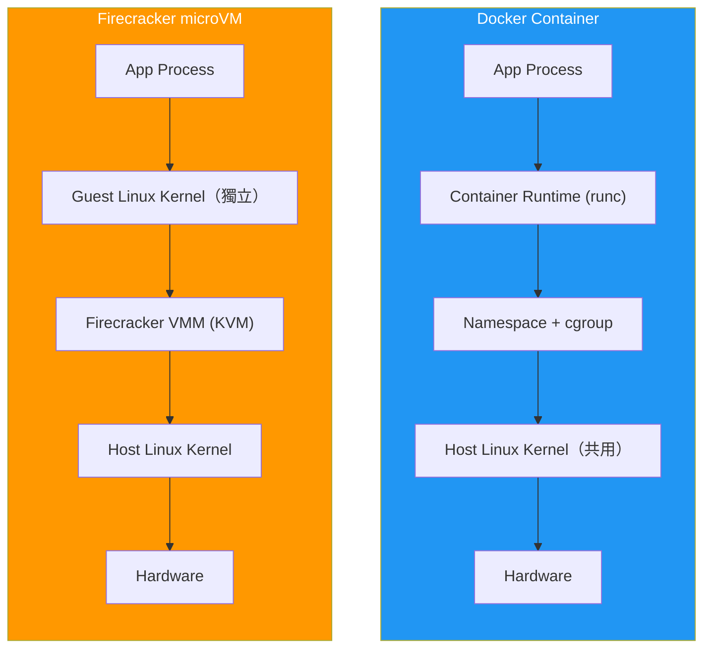

# Docker vs Firecracker (microVM) 對比分析

---

## 一、操作流程對照

以下將你提出的四個 Docker 步驟，逐一對比 Firecracker 的等效操作。

### Step 1：建立 Image

````carousel
#### Docker

```bash
# Dockerfile
FROM ubuntu:24.04
RUN apt-get update && apt-get install -y python3 curl
```

```bash
docker build -t xxx-img .
```

- **原理**：基於 OCI Image 規範，Layer by layer 疊加
- **底層**：UnionFS（OverlayFS）把多個 layer 合併成一個檔案系統視圖
- **耗時**：秒～分鐘（取決於 apt 下載速度）

<!-- slide -->

#### Firecracker

```bash
# 1. 準備 Linux Kernel（vmlinux，已編譯好）
wget https://...vmlinux

# 2. 製作 rootfs ext4 映像
truncate -s 5G ubuntu-noble.rootfs.ext4
mkfs.ext4 -F ubuntu-noble.rootfs.ext4
mount -o loop ubuntu-noble.rootfs.ext4 /mnt
tar -xJf ubuntu-noble-root.tar.xz -C /mnt

# 3. chroot 進去安裝套件
chroot /mnt /bin/bash -c "
  apt-get update
  apt-get install -y python3 curl
"
umount /mnt
```

- **原理**：需要**兩個檔案** — `vmlinux`（Kernel）+ `rootfs.ext4`（Root Filesystem）
- **底層**：真正的 ext4 檔案系統映像，不是 layer
- **耗時**：分鐘級（需下載 cloud image + chroot 安裝）
````

> [!IMPORTANT]
> **關鍵差異**：Docker Image 是 layered filesystem（分層），Firecracker 需要的是一個**完整的 OS rootfs 映像檔** + 一個 **Linux kernel binary**。Firecracker 不支持 OCI Image 格式，必須自行製作 ext4 映像。

---

### Step 2：啟動 VM / Container

````carousel
#### Docker

```bash
docker run -d -v "./data:/path/data" xxx-img
```

- Volume mount `-v` 直接把 host 目錄映射進 container
- 啟動速度：**~300ms**
- 隔離方式：**共用 host kernel**，用 namespace + cgroup 隔離

<!-- slide -->

#### Firecracker

```bash
# 1. 建立 TAP 網路介面
ip tuntap add dev fc-tap0 mode tap
ip addr add 172.30.0.1/24 dev fc-tap0
ip link set fc-tap0 up

# 2. 啟動 Firecracker process
firecracker --api-sock /tmp/fc.sock &

# 3. 透過 REST API 設定 VM
# 設定 kernel
curl -X PUT --unix-socket /tmp/fc.sock \
  -d '{"kernel_image_path":"./vmlinux","boot_args":"..."}' \
  http://localhost/boot-source

# 設定 rootfs
curl -X PUT --unix-socket /tmp/fc.sock \
  -d '{"drive_id":"rootfs","path_on_host":"./rootfs.ext4","is_root_device":true}' \
  http://localhost/drives/rootfs

# 掛載 host 資料（額外 block device）
curl -X PUT --unix-socket /tmp/fc.sock \
  -d '{"drive_id":"data","path_on_host":"./data.ext4","is_root_device":false}' \
  http://localhost/drives/data

# 設定網路
curl -X PUT --unix-socket /tmp/fc.sock \
  -d '{"iface_id":"eth0","host_dev_name":"fc-tap0",...}' \
  http://localhost/network-interfaces/eth0

# 4. 啟動 VM
curl -X PUT --unix-socket /tmp/fc.sock \
  -d '{"action_type":"InstanceStart"}' \
  http://localhost/actions

# 5. 設定 NAT（讓 VM 可上外網）
sysctl -w net.ipv4.ip_forward=1
iptables -t nat -A POSTROUTING -s 172.30.0.0/24 -j MASQUERADE
```

- **沒有 `-v` volume mount** — Firecracker 只支援 block device，不能直接 bind mount host 目錄
- 啟動速度：**~125ms**（boot 極快，但前置設定較多）
- 隔離方式：**獨立 guest kernel**，硬體虛擬化（KVM）
````

> [!WARNING]
> **Volume Mount 差異**：Docker 的 `-v ./data:/path/data` 在 Firecracker **不存在對應功能**。替代方案有：
> 1. 將 `data/` 打包成 ext4 映像，掛為額外 block device
> 2. 透過 **9pfs / virtiofs** 共享目錄（Firecracker 目前不原生支援）
> 3. 透過 **SSH / SCP / HTTP** 傳檔
> 4. 使用 **NFS / SMB** 網路檔案系統

---

### Step 3：在 VM/Container 中列出檔案

````carousel
#### Docker

```bash
docker exec -it xxx-container sh -c "ls -al /path/data/"
```

- `docker exec` 直接在運行中的 container 執行指令
- 無需網路，透過 Docker daemon 的 API 完成

<!-- slide -->

#### Firecracker

```bash
# 方法 A：SSH 連線
ssh root@172.30.0.2 "ls -al /mnt/data/"

# 方法 B：透過 serial console（如果有設定）
# 直接在 screen/minicom 連接 serial port 操作
```

- **沒有 `exec` 等效指令** — Firecracker 是真正的 VM
- 必須透過 SSH 或 serial console 與 guest 互動
- 需要 guest 內有 SSH server 且網路已設定
````

---

### Step 4：在 VM/Container 中執行 Python 程式

````carousel
#### Docker

```bash
docker exec -it xxx-container sh -c "uv run /path/data/test-01.py"
```

- 直接執行，`/path/data/` 已透過 volume mount 可見

<!-- slide -->

#### Firecracker

```bash
# 方法 A：SSH 執行
ssh root@172.30.0.2 "uv run /mnt/data/test-01.py"

# 方法 B：先傳檔再執行
scp test-01.py root@172.30.0.2:/tmp/
ssh root@172.30.0.2 "uv run /tmp/test-01.py"
```

- 若檔案在額外掛載的 block device（data.ext4），需在 guest 內 `mount` 才能存取
- 若無共享檔案系統，需先用 SCP 傳入 guest
````

---

## 二、架構差異總覽



---

## 三、關鍵差異對照表

| 面向 | Docker（Container） | Firecracker（microVM） |
|---|---|---|
| **隔離層級** | Process 級（namespace + cgroup） | VM 級（KVM 硬體虛擬化） |
| **Kernel** | 共用 host kernel | 每個 VM 有**獨立 guest kernel** |
| **安全邊界** | 較弱 — container escape 攻擊面較大 | 較強 — 額外一層 VM boundary |
| **啟動速度** | ~300ms | ~125ms（boot）但前置設定較多 |
| **記憶體開銷** | 極小（共用 kernel） | 較大（每 VM 需獨立 kernel 記憶體） |
| **Image 格式** | OCI Image（分層 layer） | vmlinux + ext4 rootfs |
| **檔案共享** | `-v` bind mount（原生支援） | Block device / SSH / NFS（較複雜） |
| **執行指令** | `docker exec`（直接） | SSH / serial console（需額外設定） |
| **網路** | Docker 自動設定 bridge 網路 | 手動建立 TAP + 設定 NAT/iptables |
| **生態系** | Docker Hub、Compose、K8s 整合 | 無 registry，需自行管理 image |
| **適用平台** | Linux / macOS / Windows | **僅限 Linux**（需 KVM 支援） |
| **多租戶安全** | 不建議用於不受信任的 workload | 專為**多租戶隔離**設計（AWS Lambda 方案） |

---

## 四、建制流程對比摘要

| 階段 | Docker | Firecracker |
|---|---|---|
| **製作映像** | 寫 `Dockerfile` → `docker build` | 下載 cloud image → 建 ext4 → chroot 安裝 |
| **啟動** | `docker run` 一行搞定 | 啟動 process → REST API 設定 kernel/rootfs/net → InstanceStart |
| **進入** | `docker exec -it sh` | `ssh root@<guest-ip>` |
| **共享目錄** | `-v host:guest` | 打包 ext4 掛為 block device 或用 NFS/SCP |
| **停止** | `docker stop` | `curl PUT /actions {"action_type":"SendCtrlAltDel"}` 或 kill process |
| **清理** | `docker rm` | 刪除 socket、清 TAP、清 iptables 規則 |

---

## 五、何時選 Docker？何時選 Firecracker？

| 場景 | 推薦 |
|---|---|
| 快速開發/測試 | ✅ Docker |
| CI/CD Pipeline | ✅ Docker |
| 多租戶隔離（執行不受信任的程式碼） | ✅ Firecracker |
| Serverless / FaaS（如 AWS Lambda） | ✅ Firecracker |
| 需要極快冷啟動 + 安全隔離 | ✅ Firecracker |
| 需要 Windows / macOS 支援 | ✅ Docker |
| 大規模微服務部署 | ✅ Docker（配合 K8s） |
| Sandbox 執行 AI 生成的程式碼 | ✅ Firecracker（安全邊界更強） |

---

## 六、你的專案中的實際對應

根據 [firecracker_scripts_guide.md](file:///d:/_Code/_GitHub/firecracker-260312/pass/firecracker-260312/docs/firecracker_scripts_guide.md) 中的腳本：

| Docker 操作 | 你專案中的 Firecracker 等效腳本 |
|---|---|
| `Dockerfile` + `docker build` | [prepare-ubuntu-noble-rootfs.sh](file:///d:/_Code/_GitHub/firecracker-260312/pass/firecracker-260312/scripts/prepare-ubuntu-noble-rootfs.sh)（製作 rootfs） |
| `docker run -d -v ...` | [run-noble-vm-with-opencode.sh](file:///d:/_Code/_GitHub/firecracker-260312/pass/firecracker-260312/scripts/run-noble-vm-with-opencode.sh)（啟動 VM + 設定網路） |
| `docker exec -it sh` | [attach-microvm-shell.sh](file:///d:/_Code/_GitHub/firecracker-260312/pass/firecracker-260312/scripts/attach-microvm-shell.sh)（SSH 進入 VM） |
| `docker stop` + `docker rm` | [stop-microvm.sh](file:///d:/_Code/_GitHub/firecracker-260312/pass/firecracker-260312/scripts/stop-microvm.sh)（停止 + 清理） |
| Volume `-v ./data:/data` | [package-ro-skills.sh](file:///d:/_Code/_GitHub/firecracker-260312/pass/firecracker-260312/scripts/package-ro-skills.sh)（打包目錄為 ext4 掛為 block device） |
