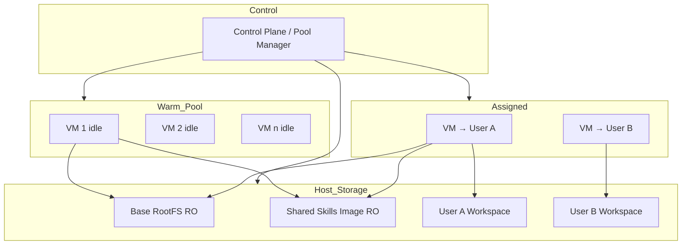
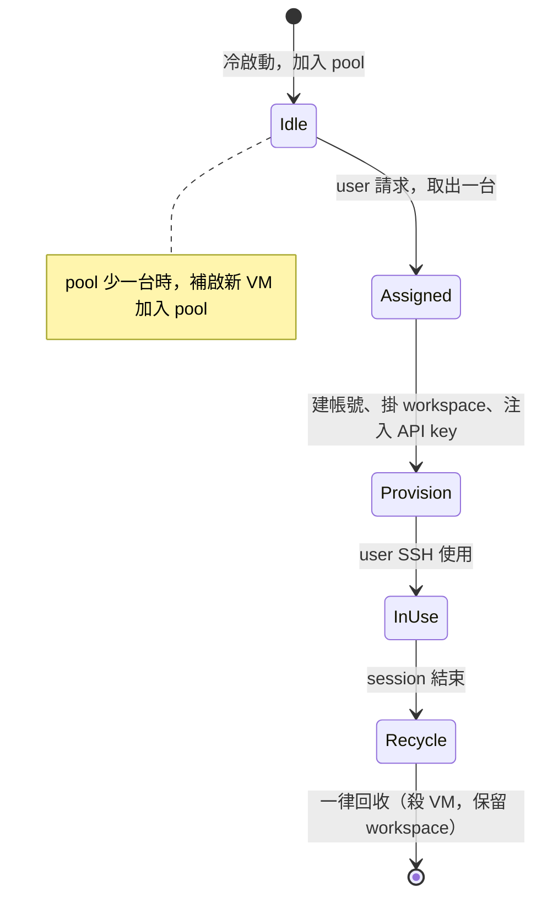

# Implementation Plan v2：OpenCode + Skills 多租戶 VM 平台

> **文件範圍：** 本文件是**架構設計與實作計畫**，聚焦於多租戶 VM 平台的整體設計決策：
> warm pool、雙層資源模型、磁碟與掛載策略、帳號管理、OpenCode 模式、實作階段規劃。
>
> 若需知道如何在本機**實際執行單一 VM 並驗證**（前置條件、執行步驟、常見錯誤排除），
> 請參閱 [RUN-VM-PREREQUISITES-AND-VERIFY.md](./RUN-VM-PREREQUISITES-AND-VERIFY.md)。

本文件為「每個 user 一台 Firecracker VM、平台共用 skills + user 私有 skills、warm pool、workspace 持久化」的落地實作計畫。實作以**新建程式**為主，不強制與現有 `fc-pro-bench-02.py` 對齊。

---

## 已確認決策摘要

| 項目 | 決策 |
|------|------|
| 租戶模型 | 每個 user 一台 VM |
| Skills | 平台共用（唯讀）+ user 私有（持久化 workspace 內）；opencode 支援多路徑 |
| LLM | 每個 user 在 VM 內使用自己的 API key 呼叫 opencode 中的 LLM |
| Pool / 回收 | 預先冷啟動 **100 台** VM 待命；**一律回收**（session 結束即殺 VM process，workspace 保留；pool 少一台即補啟一台，維持約 100 台 idle） |
| Snapshot | V1 不做 |
| Workspace | 持久化 |
| VM instance | 不持久化（session 結束即回收） |
| 套件安裝 | 不允許系統層；允許 user-space |
| Base rootfs | 改用 **Ubuntu 24.04 (noble) 正式 cloud rootfs**，確保 VM 內有完整 apt/dpkg，可下載/安裝 packages（供 skills scripts 使用） |
| OpenCode | 安裝於 base rootfs；以 **API 方式提供服務**（`opencode serve --port 4096`）。重點在每人獨有的 session/workspace；使用者不直接操作 microVM |
| SSH | 非必要（使用者不會 SSH 進 VM）；僅在測試/驗證階段由維運者使用 |

---

## 架構總覽



---

## 雙層資源模型

| 維度 | 輕量互動（多數 user） | 開發機（少數工程師） |
|------|------------------------|------------------------|
| 定位 | 大量 user、輕量互動 | 較少 user、每人像一台開發機 |
| vCPU | 1 | 2～4 |
| RAM | 1 GB | 2～4 GB |
| Workspace 容量 | 5～10 GB | 20～50 GB |
| 預期用途 | 問答、小改動、跑腳本 | 編譯、測試、多工具鏈、大 repo |
| Warm pool 預留 | 可多預留，降低成本優先 | 少預留或按需冷啟動 |

實作時建議用 **tier 標籤**（如 `light` / `dev`）區分，建立 VM 時依 tier 選擇不同 kernel args、drive 配置與 CPU/memory 設定。

---

## 磁碟與掛載策略

### Host 端檔案角色

| 角色 | 說明 | 掛進 Guest 方式 | 讀寫 |
|------|------|------------------|------|
| Base rootfs | 內建 opencode、runtime、基礎系統 | 第一顆 block device，root | RO |
| Shared skills | 平台共用 skills 目錄打包成的映像 | 第二顆 block device | RO |
| User workspace | 該 user 專屬目錄（持久化） | 第三顆 block device 或 host 檔案服務 | RW |

### Guest 內目錄規劃

| 路徑 | 來源 | 說明 |
|------|------|------|
| `/` | Base rootfs | 系統 + opencode CLI |
| `/home/<user>/workspace` | User workspace | 專案根目錄區（每個專案目錄下可有 `project/skills`） |
| `/home/<user>/.config/opencode/skills` | Shared skills 映像 | OpenCode 預設 RO skills 目錄（平台共用 skills，唯讀） |
| `/home/<user>/.opencode` | User workspace | 設定、快取（可選） |

opencode 支援多路徑；其中：
- **RO 共用 skills**：位於 `~/.config/opencode/skills`（由平台掛載 shared skills 映像）。  
- **專案 / 私有 skills**：位於專案目錄下的 `project/skills`（例如 `~/workspace/my-project/skills`）。

### Shared skills 映像製作

- 在 host 將「平台共用 skills」目錄打包成 **ext4 或 squashfs** 映像。
- 每次更新共用 skills 後重建映像，再讓新開或還原的 VM 掛載新映像；已運行中 VM 可下次 boot 再掛新版本。

---

## 開機掛載：rc.local / systemd oneshot / cloud-init 差異

Guest 開機後須把 `/dev/vdb`、`/dev/vdc` 掛到 `/opt/opencode/skills` 與 `/home/<user>/workspace`。三種做法差異如下。

### 1. `/etc/rc.local`

- **是什麼**：傳統的「開機最後階段執行一次」的腳本；若檔案存在且可執行，init 會在其生命週期尾聲執行它。
- **優點**：簡單、不依賴 systemd；適合精簡 rootfs。
- **缺點**：依發行版而異（有的預設沒有 rc.local，或需手動 `chmod +x`）；執行順序與依賴較難精確控制；不適合複雜或需重試的邏輯。

### 2. systemd oneshot

- **是什麼**：定義一個 **Type=oneshot** 的 unit，在 **Before=multi-user.target**（或自訂依賴）時執行一段腳本（例如做 `mkdir` + `mount`），跑完即結束。
- **優點**：與 systemd 整合、可明確依賴（例如等 `dev-vdb.device`）、可設重試與逾時；發行版若用 systemd 則一致。
- **缺點**：需寫 unit 檔；rootfs 需有 systemd。

### 3. cloud-init

- **是什麼**：一套在開機時讀取 **metadata**（通常由 hypervisor 或 host 提供，例如 NoCloud 的 ISO/DS 或 config drive），並依 YAML 設定做：改 hostname、建 user、寫 SSH key、掛載、跑 runcmd 等。
- **優點**：最適合「每台 VM 參數不同」：例如每台 VM 的 `<user>`、靜態 IP 由 metadata 注入，開機時自動建帳號、掛載；不需在 base 裡寫死 user 名。
- **缺點**：base rootfs 需裝 cloud-init；需在 host 端為每台 VM 準備 metadata（或共用同一份模板）；較重。

**建議**：若 **每台 VM 的 user 名與 workspace 掛載點在分配時才決定**，且希望「開機即建好帳號、掛好碟」，用 **cloud-init** 最合適；若先求簡單、user 名可暫時寫死，可用 **systemd oneshot** 或 **rc.local** 只做掛載，帳號由 host 在分配時經 SSH 連進 guest 再建。

---

## 「預先建好 user 帳號」的用意

- **預先建好**：在 **製作 base rootfs 時**就建立一個固定帳號（例如 `dev` 或 `opencode`），所有 VM 共用同一個登入帳號；SSH 時大家都用同一個名字，靠 **SSH key 或密碼** 區分（或不再區分，僅供內部使用）。
- **不預先建、改為依 user 建立**：base 裡 **不**預先建「最終 user」；每台 VM 分配給某位 user 時，再在 **該 VM 內**建立該 user 的帳號（例如 `alice`、`bob`），並設定 SSH key、home、權限。這樣每個 user 用自己的帳號登入，權限與目錄天然隔離。

本專案採用 **每台 VM 依 user 建立帳號**，因此不在 base 裡預先建好「最終 user」；base 可只保留 root 或一個僅供 host 做 provisioning 用的管理帳號，真正給使用者登入的帳號在 **VM 分配時**於 guest 內動態建立。

---

## 如何將 opencode 安裝到 base rootfs 內

opencode 以 **官方 install script** 安裝為主（`curl -fsSL https://opencode.ai/install | bash`）。

### 建議做法：使用專案一鍵腳本

本專案提供 `scripts/prepare-ubuntu-noble-rootfs.sh`，一次完成以下工作：

- 下載 Ubuntu 24.04 noble 的 `noble-server-cloudimg-amd64-root.tar.xz`
- 建立單一 ext4 rootfs 容器並解壓
- chroot 進 rootfs，用 apt 安裝 curl/ca-certificates、JS/Python toolchain、build-essential
- 在 rootfs 內執行 OpenCode 官方 install script
- 建立 `~/.config/opencode/skills` 的 skeleton（透過 `/etc/skel`）

> 舊的 quickstart `bionic.rootfs.ext4` 仍可作為 Firecracker bench 用，但不建議拿來當「可安裝套件、可跑 scripts」的長期 base。

完整的執行步驟與常見錯誤排除，請參閱 [RUN-VM-PREREQUISITES-AND-VERIFY.md](./RUN-VM-PREREQUISITES-AND-VERIFY.md)。

### 手動 chroot 安裝（若不使用一鍵腳本）

若需在既有 rootfs 上手動安裝 opencode，可在 host 上 chroot 進 rootfs 後執行：

```bash
# 掛載 rootfs
sudo mount -o loop /path/to/base.rootfs.ext4 /mnt/rootfs
# 掛載 proc/sys/dev 以便 chroot 內網路與套件正常
sudo mount -t proc none /mnt/rootfs/proc
sudo mount -t sysfs none /mnt/rootfs/sys
sudo mount -o bind /dev /mnt/rootfs/dev
# 安裝 opencode
sudo chroot /mnt/rootfs /bin/bash -c "curl -fsSL https://opencode.ai/install | bash"
# 建立 skills 目錄
sudo chroot /mnt/rootfs /bin/bash -c "mkdir -p /etc/skel/.config/opencode/skills"
# 清理並卸載
sudo chroot /mnt/rootfs /bin/bash -c "apt-get clean || true"
sudo umount -R /mnt/rootfs
```

之後用此 `base.rootfs.ext4` 當 Firecracker 的 rootfs 即可；第二顆碟掛到 `~/.config/opencode/skills`（共用 skills），第三顆掛到 `/home/<user>/workspace`，並在分配時建立該 user 與其 API key（見下節）。

---

## User 帳號與 API key 注入（分配時）

- **每台 VM 依 user 建立帳號**：從 pool 取出一台 VM 後，host 透過 **SSH 以 root 或管理帳號** 連入該 guest，執行：
  - `useradd -m -s /bin/bash <username>`
  - 設定該 user 的 SSH key（`~/.ssh/authorized_keys`）或密碼
  - 建立 `/home/<user>/workspace` 並將第三顆碟掛載於此（若開機腳本尚未掛載，或由 cloud-init 依 metadata 掛載）
- **每個 user 自己的 API key**：同一連線或透過檔案注入，在該 user 的 home 下寫入 opencode 所需的 API key（例如 `~/.opencode/env` 或 `~/.config/opencode` 的設定），內容為該 user 的 LLM API key，供 opencode 在 VM 內呼叫 LLM 使用。

---

## Warm Pool 與 VM 生命週期

### 策略：一律回收 + Pool 維持 100 台

- **Pool**：預先冷啟動 **100 台** VM 待命（idle，未綁定 user）。
- **User 請求 VM 時**：從 pool 取出一台 → 在該 VM（guest）內依該 user 建立帳號、掛載其持久化 workspace、注入其 API key（細節見「User 帳號與 API key 注入」）→ 回傳 SSH 連線資訊給 user。
- **Session 結束**：**一律回收**該 VM（殺 process），**不**放回 pool；該 user 的 workspace 磁碟保留。Pool 少一台就 **補啟動一台新 VM** 加入 pool，使 pool 維持約 100 台。

因此 **pool 不需要改變**：pool 裡始終是「無特定 user、未掛載個人 workspace」的通用 VM；只有「分配給 user」時才在 guest 內建帳號、掛 workspace、寫 API key。每台 VM 從建立到回收只服務一位 user。

### 狀態流轉



---

## Firecracker API 要點（新建程式）

實作以**新建程式**為主。多磁碟 + 網路時，在 `InstanceStart` 前需完成：

- `PUT /drives/rootfs`：維持，base rootfs，`is_root_device: true`，`is_read_only: true`。
- `PUT /drives/shared_skills`：第二顆碟，`is_root_device: false`，`is_read_only: true`，`path_on_host` 指向 shared skills 映像（將來會掛到各 user 的 `~/.config/opencode/skills`）。  
- `PUT /drives/workspace`：第三顆碟，`is_root_device: false`，`is_read_only: false`，`path_on_host` 指向該 user 的 workspace 映像或 block 檔案。

Guest 內需在開機腳本或 cloud-init 中，將 shared skills 映像掛到每個 user 的 `~/.config/opencode/skills`，並將 workspace 映像掛到 `/home/<user>/workspace`（或先掛到固定點再 bind mount）。  
若採用 **tap 網路**，需在 API 中增加網路介面配置（例如 `PUT /network-interfaces/eth0`），以便 guest 可連 LLM 或未來 API Server。

---

## OpenCode 模式：CLI → API Server（guest 內）

- **V1（現階段）**：以 **API Server** 方式提供服務：在 VM 內執行 `opencode serve --port 4096`。  
  - 安裝位置：base rootfs 內，由官方 install script 安裝（例如 `/usr/local/bin/opencode`）。  
  - **共用 RO skills**：`~/.config/opencode/skills`（由 shared skills 映像掛載而來，唯讀）。  
  - **專案 / 私有 skills**：每個專案目錄下的 `project/skills`。  
  - 每個 user 的 LLM API key 由平台以「每人獨有 workspace/session」方式注入（細節依 opencode config 形式落地）。  
- **後續目標**：在 **guest 內**以 API Server 形式執行 opencode，對外提供 HTTP/RPC；port forward 若需要則在 host 層處理，與 VM 無關。  
- **先不考慮**：在 guest 外（host）跑 opencode API Server、guest 內僅 client 的架構。

---

## SSH 連線方式

- **測試/驗證用**：維運者可從 host 連到 guest（例如 `ssh user@<guest_tap_ip>`）；一般使用者不會直接登入 VM。
  具體 SSH 驗證步驟請參閱 [RUN-VM-PREREQUISITES-AND-VERIFY.md 第 4 節](./RUN-VM-PREREQUISITES-AND-VERIFY.md#4-驗證-microvmattach-shell)。
- **後期**：若需從外網連到 VM，在 host 層做 port forward；但此非主要使用路徑。

---

## User-Space 安裝策略

- **不允許系統層安裝**：guest 內無 `sudo` 或僅限白名單指令；不允許 `apt install`、`yum install` 等改動系統。
- **允許 user-space 安裝**：  
  - 允許在 `/home/<user>/workspace` 或 `~/.local` 使用 `pip install --user`、`npm install`、`cargo install`、venv 等。  
  - 基礎工具（如 `python3`、`node`、`git`）建議預裝在 base rootfs，以支援多數輕量互動與部分開發機需求。

---

## 實作階段建議

### Phase 1：單 VM 可運行 OpenCode + 雙 skills

- 準備 base rootfs（含 opencode CLI、runtime）。
- 準備 shared skills 映像並掛載為第二顆碟，在 guest 掛到 `/opt/opencode/skills`。
- 準備一塊 user workspace 映像掛載為第三顆碟，掛到 `/home/<user>/workspace`。
- 在 guest 內驗證：CLI 可執行、可讀共用 skills、可讀寫 workspace 內私有 skills。

### Phase 2：Warm pool + 雙 tier

- 實作 pool 管理：預先冷啟動約 100 台 idle VM（未綁定 user、可掛空白或未掛 workspace 的通用 VM）。
- 支援 `light` / `dev` 兩種配置（vCPU、RAM、disk 大小）。
- User 請求時從 pool 取出一台 → 在 guest 內建該 user 帳號、掛載該 user 的 **持久化 workspace**、注入 API key → 回傳 SSH 資訊；**session 結束一律回收**該 VM（殺 process），pool 少一台即補啟一台。

### Phase 3：回收與 workspace 保留

見上文「Warm Pool 與 VM 生命週期」：session 結束一律回收 VM，workspace 磁碟保留；同 user 再請求時由新 VM 掛載同一份 workspace。

### Phase 4（可選）：OpenCode API Server

- 在 guest 內以 API Server 模式啟動 opencode。
- 平台透過 VM 的網路位址呼叫 API；必要時可搭配認證與 rate limit。

---

## TO-DO List（實作時勾選）

- [ ] 定義 pool 大小常數（例：POOL_SIZE = 100）
- [ ] 實作兩套 VM 規格（light / dev）的 Firecracker 設定
- [ ] 製作 Ubuntu 24.04 noble base rootfs（`scripts/prepare-ubuntu-noble-rootfs.sh`）
- [ ] 製作 shared skills 映像，並在 guest 開機時計畫性地掛載到每個 user 的 `~/.config/opencode/skills`（rc.local / systemd / cloud-init 擇一）
- [ ] 實作 user workspace 的建立與掛載（per-user block）
- [ ] **新建**腳本：多 drive + tap 網路 + Firecracker API
- [ ] 實作 warm pool（建立、取用、**一律回收**、補啟補足）
- [ ] 實作分配時 provisioning：建立 session/workspace、注入 API key、啟動 opencode serve（必要時僅測試階段使用 SSH）
- [ ] 文件化 OpenCode API（`opencode serve --port 4096`）與 skills 目錄約定（~/.config/opencode/skills、project/skills）
- [ ] 量測並記錄 opencode 啟動時間（startup time）
- [ ] 後續：guest 內 OpenCode API Server 部署與 endpoint 約定

---

## 一句話總結

- **Pool**：預先冷啟動約 100 台 VM 待命；user 請求時取出一台，**分配時**在 guest 內建帳號、掛 workspace、注入 API key；**session 結束一律回收** VM（殺 process），workspace 保留，pool 少一台即補啟一台。
- **雙層資源**：輕量互動 1 vCPU/1 GB；開發機 2～4 vCPU、2～4 GB、較大 workspace。
- **Skills**：平台共用唯讀 `/opt/opencode/skills`，user 私有 `~/workspace/.skills`；opencode 來自 npm，支援多路徑。
- **OpenCode**：安裝於 base rootfs；V1 CLI，後續 guest 內 API Server；先不考慮 host 端 API Server。
- **SSH**：每台 VM 依 user 建立帳號；僅從 host 連到 guest（後期 port forward 在 host 層）。
- **套件**：不允許系統層安裝；允許 user-space 安裝。
