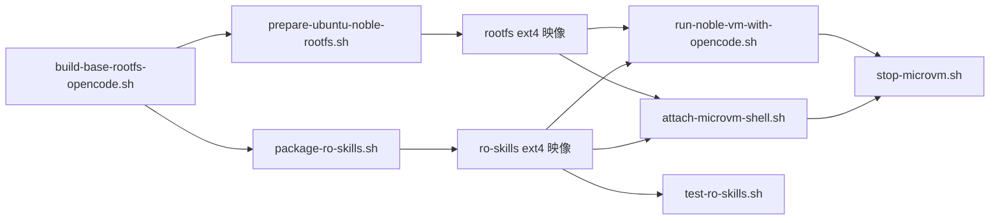

# Firecracker Shell Scripts 完整指令解說

> 本文件針對 Linux 初學者，逐行解說 `scripts/` 目錄下所有 shell script 使用到的 Linux 指令與參數。  
> **同一指令只在首次出現時詳細說明，後續出現僅簡短帶過。**

---

## 目錄

- [腳本總覽](#腳本總覽)
- [Linux 指令速查表](#linux-指令速查表)
- [1. prepare-ubuntu-noble-rootfs.sh](#1-prepare-ubuntu-noble-rootfssh)
- [2. build-base-rootfs-opencode.sh](#2-build-base-rootfs-opencodesh)
- [3. package-ro-skills.sh](#3-package-ro-skillssh)
- [4. run-noble-vm-with-opencode.sh](#4-run-noble-vm-with-opencodesh)
- [5. attach-microvm-shell.sh](#5-attach-microvm-shellsh)
- [6. stop-microvm.sh](#6-stop-microvmsh)
- [7. test-ro-skills.sh](#7-test-ro-skillssh)

---

## 腳本總覽

| 腳本 | 用途 |
|---|---|
| [prepare-ubuntu-noble-rootfs.sh](file:///d:/_Code/_GitHub/firecracker-260312/pass/firecracker-260312/scripts/prepare-ubuntu-noble-rootfs.sh) | 製作 Ubuntu 24.04 ext4 rootfs 映像檔（核心腳本） |
| [build-base-rootfs-opencode.sh](file:///d:/_Code/_GitHub/firecracker-260312/pass/firecracker-260312/scripts/build-base-rootfs-opencode.sh) | 上述腳本的「便利包裝」，一鍵呼叫 |
| [package-ro-skills.sh](file:///d:/_Code/_GitHub/firecracker-260312/pass/firecracker-260312/scripts/package-ro-skills.sh) | 將 skills 目錄打包成唯讀 ext4 映像 |
| [run-noble-vm-with-opencode.sh](file:///d:/_Code/_GitHub/firecracker-260312/pass/firecracker-260312/scripts/run-noble-vm-with-opencode.sh) | 啟動 microVM 並量測 opencode 啟動時間 |
| [attach-microvm-shell.sh](file:///d:/_Code/_GitHub/firecracker-260312/pass/firecracker-260312/scripts/attach-microvm-shell.sh) | 啟動 microVM 並透過 SSH 取得互動式 shell |
| [stop-microvm.sh](file:///d:/_Code/_GitHub/firecracker-260312/pass/firecracker-260312/scripts/stop-microvm.sh) | 停止並清理 microVM |
| [test-ro-skills.sh](file:///d:/_Code/_GitHub/firecracker-260312/pass/firecracker-260312/scripts/test-ro-skills.sh) | 驗證 RO skills 映像內容 |



---

## Linux 指令速查表

以下是所有腳本中出現的 Linux 指令集中整理，方便快速查找：

| 指令 | 簡述 | 首次出現 |
|---|---|---|
| `set -euo pipefail` | Bash 嚴格模式 | prepare-ubuntu-noble-rootfs.sh |
| `cat <<'EOF'` | Here Document | prepare-ubuntu-noble-rootfs.sh |
| `shift` | 移除位置參數 | prepare-ubuntu-noble-rootfs.sh |
| `cd` | 切換目錄 | prepare-ubuntu-noble-rootfs.sh |
| `dirname` | 取得路徑的目錄部分 | prepare-ubuntu-noble-rootfs.sh |
| `pwd` | 列印當前工作目錄 | prepare-ubuntu-noble-rootfs.sh |
| `echo` | 輸出文字 | prepare-ubuntu-noble-rootfs.sh |
| `command -v` | 檢查指令是否存在 | prepare-ubuntu-noble-rootfs.sh |
| `mkdir -p` | 建立目錄（含父目錄） | prepare-ubuntu-noble-rootfs.sh |
| `basename` | 取得路徑最後一段 | prepare-ubuntu-noble-rootfs.sh |
| `mktemp` | 建立暫存檔案/目錄 | prepare-ubuntu-noble-rootfs.sh |
| `umount` | 卸載檔案系統 | prepare-ubuntu-noble-rootfs.sh |
| `rm` | 刪除檔案/目錄 | prepare-ubuntu-noble-rootfs.sh |
| `trap` | 設定訊號處理 | prepare-ubuntu-noble-rootfs.sh |
| `curl` | HTTP 請求工具 | prepare-ubuntu-noble-rootfs.sh |
| `truncate` | 建立/調整檔案大小 | prepare-ubuntu-noble-rootfs.sh |
| `mkfs.ext4` | 格式化為 ext4 檔案系統 | prepare-ubuntu-noble-rootfs.sh |
| `mount` | 掛載檔案系統 | prepare-ubuntu-noble-rootfs.sh |
| `tar` | 解壓/打包檔案 | prepare-ubuntu-noble-rootfs.sh |
| `chroot` | 切換根目錄 | prepare-ubuntu-noble-rootfs.sh |
| `apt-get` | Debian/Ubuntu 套件管理 | prepare-ubuntu-noble-rootfs.sh |
| `systemctl` | 管理 systemd 服務 | prepare-ubuntu-noble-rootfs.sh |
| `cp` | 複製檔案 | prepare-ubuntu-noble-rootfs.sh |
| `chpasswd` | 批次修改密碼 | prepare-ubuntu-noble-rootfs.sh |
| `read` | 讀取使用者輸入 | build-base-rootfs-opencode.sh |
| `exec` | 替換當前 process | build-base-rootfs-opencode.sh |
| `ip` | 網路介面管理 | run-noble-vm-with-opencode.sh |
| `kill` | 傳送訊號給 process | run-noble-vm-with-opencode.sh |
| `seq` | 產生數字序列 | run-noble-vm-with-opencode.sh |
| `sleep` | 暫停執行 | run-noble-vm-with-opencode.sh |
| `date` | 取得日期/時間 | run-noble-vm-with-opencode.sh |
| `ping` | 測試網路連通性 | run-noble-vm-with-opencode.sh |
| `timeout` | 限時執行指令 | run-noble-vm-with-opencode.sh |
| `tail` | 顯示檔案末尾 | run-noble-vm-with-opencode.sh |
| `sed` | 串流文字編輯器 | run-noble-vm-with-opencode.sh |
| `ssh` | SSH 遠端連線 | attach-microvm-shell.sh |
| `source` | 載入 shell 腳本 | stop-microvm.sh |
| `pgrep` | 按名稱搜尋 process | stop-microvm.sh |
| `shopt` | 設定 Bash 選項 | stop-microvm.sh |
| `test` / `[[ ]]` | 條件測試 | prepare-ubuntu-noble-rootfs.sh |
| `find` | 搜尋檔案 | test-ro-skills.sh |
| `grep` | 文字搜尋 | test-ro-skills.sh |

---

## 1. prepare-ubuntu-noble-rootfs.sh

> **用途**：製作一顆包含 Ubuntu 24.04 環境的 ext4 rootfs 映像檔，供 Firecracker microVM 使用。內含 OpenCode、JS/Python 執行環境。

### Shebang 與嚴格模式

```bash
#!/usr/bin/env bash
```
- `#!`（Shebang）：告訴作業系統用哪個程式來執行此腳本
- `/usr/bin/env bash`：透過 `env` 在 `$PATH` 中尋找 `bash`，比硬寫 `/bin/bash` 更具可攜性

```bash
set -euo pipefail
```
> [!IMPORTANT]
> 這是 Bash **嚴格模式**，幾乎所有正式腳本都建議使用：

| 旗標 | 作用 |
|---|---|
| `-e` | 任何指令回傳非零（失敗）時，立即中止腳本 |
| `-u` | 使用未定義的變數時，立即報錯並中止（防止打錯變數名） |
| `-o pipefail` | 管線（pipe）中任一指令失敗，整個管線的回傳值就是失敗（預設只看最後一個） |

### 變數宣告

```bash
UBUNTU_ROOT_TAR_URL_DEFAULT="https://cloud-images.ubuntu.com/noble/current/noble-server-cloudimg-amd64-root.tar.xz"
OUTPUT_PATH=""
SIZE_GB="5"
ROOT_TAR_URL="${UBUNTU_ROOT_TAR_URL_DEFAULT}"
ENABLE_SSH="false"
DISABLE_RESOLVED="false"
```
- `VAR="value"`：Bash 變數賦值，**等號兩邊不可有空格**
- `${VAR}`：變數展開（取值），用 `${}` 包起來可避免歧義

### usage 函式與 Here Document

```bash
usage() {
  cat <<'EOF'
用法：
  sudo ./scripts/prepare-ubuntu-noble-rootfs.sh ...
EOF
}
```
- `usage()`：定義一個函式
- `cat`：將標準輸入的內容輸出到終端機
- `<<'EOF' ... EOF`：**Here Document**，把多行文字原樣送給 `cat`
  - 用 `'EOF'`（帶引號）表示內容中的 `$` 等特殊字元**不展開**
  - 若用 `<<EOF`（不帶引號），變數會被展開

### 參數解析迴圈

```bash
while [[ $# -gt 0 ]]; do
  case "$1" in
    --output)
      OUTPUT_PATH="${2:-}"; shift 2;;
    --size-gb)
      SIZE_GB="${2:-}"; shift 2;;
    --enable-ssh)
      ENABLE_SSH="true"; shift;;
    -h|--help)
      usage; exit 0;;
    *)
      echo "未知參數：$1"
      usage
      exit 1;;
  esac
done
```

| 語法 | 說明 |
|---|---|
| `$#` | 目前剩餘的命令列參數數量 |
| `-gt 0` | 「大於 0」（greater than） |
| `$1` | 第一個位置參數 |
| `${2:-}` | 第二個參數，若不存在則為空字串（`:-` 是預設值語法） |
| `shift 2` | 將位置參數左移 2 個（`$3` 變 `$1`，`$4` 變 `$2`…），已處理的參數被丟棄 |
| `shift` | 左移 1 個 |
| `case ... esac` | 模式匹配（類似 switch/case） |
| `;;` | 結束一個 case 分支 |
| `*`（在 case 中） | 萬用匹配，對應不到任何已知參數時觸發 |
| `exit 0` | 正常退出（0 = 成功） |
| `exit 1` | 異常退出（非零 = 失敗） |

### 取得腳本目錄的絕對路徑

```bash
SCRIPT_DIR="$(cd "$(dirname "${BASH_SOURCE[0]}")" && pwd)"
ROOT_DIR="$(cd "${SCRIPT_DIR}/.." && pwd)"
```

| 指令/變數 | 說明 |
|---|---|
| `${BASH_SOURCE[0]}` | 當前腳本的檔案路徑（比 `$0` 更可靠，不受 `source` 影響） |
| `dirname <path>` | 從路徑中取出目錄部分，例如 `dirname /a/b/c.sh` → `/a/b` |
| `cd <dir> && pwd` | 先切到該目錄，若成功再用 `pwd` 印出絕對路徑（將相對路徑轉成絕對路徑的慣用技巧） |
| `$(...)` | **命令替換（Command Substitution）**，執行括號內的指令，並將結果當作字串使用 |

```bash
OUTPUT_PATH="${OUTPUT_PATH:-${ROOT_DIR}/bin/ubuntu-noble-base.rootfs.ext4}"
```
- `${VAR:-default}`：若 `VAR` 未設定或為空，使用 `default` 值

### 環境檢查（root 權限）

```bash
if [[ $EUID -ne 0 ]]; then
  echo "錯誤：本腳本需要 root 權限（會 mount loop 與 chroot）。"
  echo "請改用：sudo $0 [--output <path>]"
  exit 1
fi
```

| 語法 | 說明 |
|---|---|
| `[[ ... ]]` | Bash 擴充條件測試（比 `[ ]` 更安全，支援 `&&`、`||`、正則等） |
| `$EUID` | **Effective User ID**，root 是 `0` |
| `-ne` | 「不等於」（not equal） |
| `$0` | 當前腳本的路徑 |

### 檢查必要外部指令

```bash
command -v curl >/dev/null 2>&1 || { echo "錯誤：host 缺少 curl"; exit 1; }
command -v xz   >/dev/null 2>&1 || { ... }
command -v mkfs.ext4 >/dev/null 2>&1 || { ... }
command -v mount >/dev/null 2>&1 || { ... }
command -v chroot >/dev/null 2>&1 || { ... }
```

| 語法 | 說明 |
|---|---|
| `command -v <cmd>` | 檢查 `<cmd>` 是否存在於 `$PATH`（比 `which` 更可靠，POSIX 標準） |
| `>/dev/null` | 將標準輸出（stdout）重導到 `/dev/null`（黑洞裝置，丟棄輸出） |
| `2>&1` | 將標準錯誤（stderr, fd=2）重導到與 stdout(fd=1) 相同的地方 |
| `||` | 前面的指令失敗時，才執行後面的指令（短路求值） |
| `{ ...; }` | 群組指令（在當前 shell 中執行，注意結尾分號和空格） |

### 建立目錄與暫存區

```bash
OUT_DIR="$(dirname "${OUTPUT_PATH}")"
mkdir -p "${OUT_DIR}"
```
- `mkdir`：建立目錄
  - `-p`：若父目錄不存在，一併建立；若目錄已存在也不報錯

```bash
ROOT_TAR_CACHE="${ROOT_DIR}/bin/$(basename "${ROOT_TAR_URL}")"
```
- `basename <path>`：取得路徑的最後一段（檔案名稱），例如 `basename /a/b/c.tar.xz` → `c.tar.xz`

```bash
WORK_DIR="$(mktemp -d -t noble-rootfs-XXXXXX)"
```
- `mktemp`：建立唯一的暫存檔案或目錄
  - `-d`：建立目錄（而非檔案）
  - `-t <template>`：指定名稱模板，`XXXXXX` 會被替換為隨機字元

### 清理函式與 trap

```bash
cleanup() {
  echo "==> 清理：卸載與刪除暫存目錄"
  umount "${MNT_DIR}/dev/pts" 2>/dev/null || true
  umount "${MNT_DIR}/dev"     2>/dev/null || true
  umount "${MNT_DIR}/sys"     2>/dev/null || true
  umount "${MNT_DIR}/proc"    2>/dev/null || true
  umount "${MNT_DIR}"         2>/dev/null || true
  rm -rf "${WORK_DIR}"        2>/dev/null || true
}
trap cleanup EXIT
```

| 指令 | 說明 |
|---|---|
| `umount <mountpoint>` | 卸載（取消掛載）指定的檔案系統 |
| `rm` | 刪除檔案或目錄 |
| `-r` | 遞迴刪除（刪除目錄及其所有內容） |
| `-f` | 強制刪除，不詢問確認，檔案不存在也不報錯 |
| `|| true` | 即使前面的指令失敗也不中止（因為 `set -e`，失敗會導致腳本中止，加上 `|| true` 可忽略錯誤） |
| `trap <function> EXIT` | 當腳本結束時（無論正常或異常），自動呼叫 `cleanup`。這是資源清理的標準做法 |

### Step 1：下載 Ubuntu root tarball

```bash
if [[ -f "${ROOT_TAR_CACHE}" ]]; then
  echo "  - 使用既有快取：${ROOT_TAR_CACHE}"
  ROOT_TAR_XZ="${ROOT_TAR_CACHE}"
else
  mkdir -p "${ROOT_DIR}/bin"
  curl -fL "${ROOT_TAR_URL}" -o "${ROOT_TAR_CACHE}"
  ROOT_TAR_XZ="${ROOT_TAR_CACHE}"
fi
```

| 語法/參數 | 說明 |
|---|---|
| `-f` (在 `[[ ]]` 中) | 測試檔案是否存在且為一般檔案（非目錄） |
| `curl` | 命令列 HTTP 用戶端工具 |
| `-f` (curl) | 若 HTTP 錯誤（如 404），curl 回傳失敗（而非輸出錯誤頁面內容） |
| `-L` (curl) | 跟隨 HTTP 重導向（3xx） |
| `-o <file>` (curl) | 將下載內容儲存到指定檔案 |

### Step 2：建立 ext4 映像檔

```bash
rm -f "${OUTPUT_PATH}"
truncate -s "${SIZE_GB}G" "${OUTPUT_PATH}"
mkfs.ext4 -F "${OUTPUT_PATH}" >/dev/null
```

| 指令 | 說明 |
|---|---|
| `truncate` | 建立或調整檔案大小（**不寫入實際資料，只分配大小**，速度極快） |
| `-s <size>` | 指定目標大小，`G` 表示 GB，`M` 表示 MB |
| `mkfs.ext4` | 在檔案（或裝置）上建立 ext4 檔案系統 |
| `-F` (mkfs.ext4) | 強制執行，即使目標不是真實的區塊裝置（因為我們是在檔案上格式化） |

### Step 3：掛載映像檔並解壓

```bash
mkdir -p "${MNT_DIR}"
mount -o loop "${OUTPUT_PATH}" "${MNT_DIR}"
```

| 參數 | 說明 |
|---|---|
| `mount` | 掛載檔案系統到指定目錄（掛載點） |
| `-o loop` | 使用 loop 裝置。**loop device** 讓你把一個「檔案」當作「磁碟」來掛載，是虛擬化/映像檔的核心技巧 |

```bash
tar -xJf "${ROOT_TAR_XZ}" -C "${MNT_DIR}"
```

| 參數 | 說明 |
|---|---|
| `tar` | 打包/解壓縮工具（**T**ape **AR**chive） |
| `-x` | 解壓縮 (e**x**tract) |
| `-J` | 使用 `xz` 壓縮格式（對應 `.tar.xz` 檔案） |
| `-f <file>` | 指定要處理的壓縮檔 |
| `-C <dir>` | 解壓到指定目錄 |

### Step 4：準備 chroot 環境

```bash
mount -t proc none "${MNT_DIR}/proc"
mount -t sysfs none "${MNT_DIR}/sys"
mount --bind /dev "${MNT_DIR}/dev"
mount --bind /dev/pts "${MNT_DIR}/dev/pts"
```

> [!NOTE]
> **chroot** 會將一個目錄當作新的根目錄 `/`。要讓 chroot 裡的程式正常運作（例如 `apt-get`），必須先掛載一些虛擬檔案系統：

| 掛載 | 說明 |
|---|---|
| `mount -t proc none <dir>/proc` | 掛載 proc 檔案系統（process 資訊） |
| `mount -t sysfs none <dir>/sys` | 掛載 sysfs 檔案系統（核心/硬體資訊） |
| `mount --bind /dev <dir>/dev` | 把 host 的 `/dev` 綁定掛載到 chroot 內（讓 chroot 能存取裝置） |
| `mount --bind /dev/pts <dir>/dev/pts` | 綁定掛載偽終端機裝置 |

| 參數 | 說明 |
|---|---|
| `-t <type>` | 指定檔案系統類型（`proc`、`sysfs` 都是核心虛擬檔案系統） |
| `none` | 這些虛擬檔案系統不需要實際的來源裝置，所以用 `none` |
| `--bind` | 綁定掛載：把一個已有的目錄「映射」到另一個掛載點（類似捷徑但更底層） |

```bash
rm -f "${MNT_DIR}/etc/resolv.conf"
cp -L /etc/resolv.conf "${MNT_DIR}/etc/resolv.conf"
```

| 指令/參數 | 說明 |
|---|---|
| `cp` | 複製檔案 |
| `-L` (cp) | 跟隨 symlink（符號連結），複製實際檔案內容而非連結本身。Ubuntu Cloud Image 的 `resolv.conf` 常常是 symlink |

### Step 5：在 chroot 內安裝套件

```bash
chroot "${MNT_DIR}" /bin/bash -c "
set -e
apt-get update
DEBIAN_FRONTEND=noninteractive apt-get install -y \
  ca-certificates curl git \
  python3 python3-pip python3-venv \
  nodejs npm \
  build-essential
apt-get clean || true
"
```

| 指令/語法 | 說明 |
|---|---|
| `chroot <dir> <cmd>` | 把 `<dir>` 當作新的根目錄 `/`，然後執行 `<cmd>`。在我們的情境中，就是「進入 rootfs 映像裡面」 |
| `/bin/bash -c "..."` | 用 bash 執行一段命令字串 |
| `apt-get update` | 更新套件清單（從線上下載最新的套件索引） |
| `DEBIAN_FRONTEND=noninteractive` | 環境變數，告訴 apt 不要彈出互動式對話框（自動選擇預設值） |
| `apt-get install -y <pkg>...` | 安裝套件，`-y` 表示自動回答「是」 |
| `\`（行尾反斜線） | **續行符**，讓命令跨越多行書寫（提高可讀性） |
| `apt-get clean` | 清理已下載的 `.deb` 套件快取，節省映像空間 |

### Step 5b：安裝 uv

```bash
chroot "${MNT_DIR}" /bin/bash -c "
set -e
if command -v uv >/dev/null 2>&1; then
  echo '[rootfs] 已存在 uv，略過安裝。'
else
  UV_INSTALL_DIR=/usr/local/bin curl -LsSf https://astral.sh/uv/install.sh | sh
fi
"
```

| 參數 | 說明 |
|---|---|
| `-s` (curl) | 靜默模式，不顯示進度條 |
| `-S` (curl) | 搭配 `-s` 時，若出錯仍顯示錯誤訊息 |
| `|` | **管線（Pipe）**：將前一個指令的 stdout 送給下一個指令的 stdin |
| `sh` | 執行從管線收到的 shell script（常見的「下載後直接執行」安裝方式） |

### Step 7：建立 skills skeleton

```bash
chroot "${MNT_DIR}" /bin/bash -c "
set -e
mkdir -p /etc/skel/.config/opencode/skills
mkdir -p /root/.config/opencode/skills
"
```
- `/etc/skel/`：**Skeleton 目錄**，新建使用者時，系統會自動把 `/etc/skel/` 裡的檔案複製到新使用者的家目錄

### Step 8：建立 systemd 服務

```bash
chroot "${MNT_DIR}" /bin/bash -c "
set -e
cat > /etc/systemd/system/opencode-serve.service <<'UNIT'
[Unit]
Description=OpenCode API Server
After=network.target mount-ro-skills.service
Wants=network.target

[Service]
Type=simple
ExecStart=/usr/bin/env opencode serve --port 4096 --host 0.0.0.0
Restart=on-failure
RestartSec=2

[Install]
WantedBy=multi-user.target
UNIT

systemctl enable opencode-serve.service || true
"
```

| 語法 | 說明 |
|---|---|
| `cat > <file> <<'DELIM'` | 將 Here Document 的內容寫入檔案（`>` 是輸出重導向） |
| `systemctl enable <service>` | 設定服務為開機自動啟動（建立 symlink 到 systemd 的 `wants` 目錄） |
| `systemctl mask <service>` | 徹底停用服務（連結到 `/dev/null`，連手動啟動都不行）。在 Step 8bd 使用 |

> [!TIP]
> **systemd 服務檔（.service）各欄位說明：**
>
> | 欄位 | 說明 |
> |---|---|
> | `[Unit] Description` | 服務描述 |
> | `After=` | 在哪些服務/目標啟動之後才啟動 |
> | `Wants=` | 弱依賴，盡量啟動但不強制 |
> | `[Service] Type=simple` | 服務類型：主程序直接在前景執行 |
> | `ExecStart=` | 要執行的指令 |
> | `Restart=on-failure` | 程式非正常結束時自動重啟 |
> | `RestartSec=2` | 重啟前等待秒數 |
> | `Type=oneshot` | 執行一次就完成的任務 |
> | `RemainAfterExit=yes` | oneshot 完成後，服務狀態仍顯示為「active」 |
> | `[Install] WantedBy=multi-user.target` | 在 multi-user（一般多人操作模式）時啟動 |

### Step 8b：設定靜態 IP（Netplan）

```bash
mkdir -p "${MNT_DIR}/etc/netplan"
cat > "${MNT_DIR}/etc/netplan/99-fc-eth0.yaml" <<'YAML'
network:
  version: 2
  ethernets:
    eth0:
      dhcp4: false
      addresses: [172.30.0.2/24]
YAML
```
- Netplan 是 Ubuntu 的網路設定工具，使用 YAML 格式
- 檔名以 `99-` 開頭是為了確保在 cloud-init（通常是 `50-`）之後套用，優先級更高

### Step 8b 續：systemd drop-in 設定

```bash
mkdir -p "${MNT_DIR}/etc/systemd/system/systemd-networkd-wait-online.service.d"
cat > "${MNT_DIR}/etc/systemd/system/systemd-networkd-wait-online.service.d/timeout.conf" <<'UNIT'
[Service]
ExecStart=
ExecStart=/lib/systemd/systemd-networkd-wait-online --timeout=15
UNIT
```

> [!NOTE]
> **systemd drop-in 機制**：在 `/etc/systemd/system/<service>.d/` 目錄下放置 `.conf` 檔案，可以覆蓋或追加原始服務的設定，而不需修改原始 `.service` 檔。
> - `ExecStart=`（空值）必須先清空原本的指令，再用第二行 `ExecStart=...` 設定新值

### Step 8c：安裝 SSH（條件性）

```bash
if [[ "${ENABLE_SSH}" == "true" ]]; then
  chroot "${MNT_DIR}" /bin/bash -c "
    ...
    echo 'root:opencode' | chpasswd
  "
fi
```

| 指令 | 說明 |
|---|---|
| `chpasswd` | 從標準輸入讀取 `使用者:密碼` 格式，批次修改密碼。`echo 'root:opencode' | chpasswd` = 將 root 密碼設為 `opencode` |

### Step 10：收尾

```bash
if [[ "${DISABLE_RESOLVED}" != "true" ]]; then
  rm -f "${MNT_DIR}/etc/resolv.conf" || true
fi
```
- 若沒有停用 resolved，清掉用於 chroot 的 `resolv.conf`，讓 systemd-resolved 在 VM 開機時自行管理

---

## 2. build-base-rootfs-opencode.sh

> **用途**：`prepare-ubuntu-noble-rootfs.sh` 的薄 wrapper，加上互動式確認與自動打包 RO skills。

### 互動式確認

```bash
read -r -p "按 Enter 繼續（或 Ctrl+C 中止）..." _
```

| 參數 | 說明 |
|---|---|
| `read` | 從標準輸入讀取一行 |
| `-r` | 不解釋反斜線（raw mode），避免 `\n` 被特殊處理 |
| `-p "..."` | 顯示提示文字 |
| `_` | 把讀到的值存入 `_` 變數（慣用的「拋棄」變數名） |

### 條件性執行 package-ro-skills

```bash
if [[ -f "${RO_SKILLS_DEFAULT}" ]]; then
  echo "==> 已存在 ${RO_SKILLS_DEFAULT}，略過 package-ro-skills.sh"
else
  "$(dirname "$0")/package-ro-skills.sh" \
    --source skills/ \
    --output "${RO_SKILLS_DEFAULT}" \
    --size-mb 64
fi
```
- `$(dirname "$0")`：取得當前腳本所在的目錄，用來找到同目錄下的其他腳本

### exec 替換當前 process

```bash
exec "$(dirname "$0")/prepare-ubuntu-noble-rootfs.sh" \
  --output "${ROOTFS_DEFAULT}" \
  --size-gb 5 \
  --disable-resolved \
  --enable-ssh
```

| 指令 | 說明 |
|---|---|
| `exec` | 用指定的程式**取代**當前 shell process。不會產生新的子 process，效率更高；但 `exec` 之後的行不會被執行 |

---

## 3. package-ro-skills.sh

> **用途**：將 `skills/` 目錄的內容打包成一個唯讀 ext4 映像檔。

### 核心流程

```bash
rm -f "${OUTPUT_PATH}"
truncate -s "${SIZE_MB}M" "${OUTPUT_PATH}"
mkfs.ext4 -F "${OUTPUT_PATH}" >/dev/null
mkdir -p "${MNT}"
mount -o loop "${OUTPUT_PATH}" "${MNT}"
cp -a "${SOURCE_DIR}"/. "${MNT}/"
umount "${MNT}"
```

| 指令/參數 | 說明 |
|---|---|
| `cp -a` | **歸檔複製**，等同 `-dR --preserve=all`：保留所有屬性（權限、時間戳、symlink 等），遞迴複製 |
| `"${SOURCE_DIR}"/.` | 複製 `SOURCE_DIR` **目錄內的所有內容**（包含隱藏檔），`.` 是「目錄本身的內容」的意思 |

> 其餘指令（`truncate`、`mkfs.ext4`、`mount -o loop`、`umount`、`trap`）已在 prepare 腳本中說明。

---

## 4. run-noble-vm-with-opencode.sh

> **用途**：啟動 Firecracker microVM，自動量測 opencode serve 的啟動時間（benchmark）。

### Step 1：建立 TAP 網路介面

```bash
ip tuntap add dev "${TAP_NAME}" mode tap || true
ip addr flush dev "${TAP_NAME}" 2>/dev/null || true
ip addr add "${HOST_IP}/24" dev "${TAP_NAME}" || true
ip link set "${TAP_NAME}" up
```

| 指令 | 說明 |
|---|---|
| `ip` | Linux 網路管理工具（取代舊版 `ifconfig`、`route` 等） |
| `ip tuntap add dev <name> mode tap` | 建立 TAP 虛擬網路裝置。**TAP** 模擬乙太網路（L2），是 VM 與 host 之間的網路橋樑 |
| `ip addr flush dev <name>` | 清除該介面上所有 IP 位址（避免重複設定時報錯） |
| `ip addr add <ip>/<mask> dev <name>` | 為介面添加 IP 位址。`/24` 表示子網遮罩 255.255.255.0 |
| `ip link set <name> up` | 啟用（開啟）網路介面 |
| `ip link del <name>` | 刪除網路介面（在 cleanup 函式中使用） |

### Step 2：啟動 Firecracker process

```bash
rm -f "${API_SOCK}" "${LOG_FILE}"
"${FC_BINARY}" --api-sock "${API_SOCK}" --id "${VM_ID}" >"${LOG_FILE}" 2>&1 &
FC_PID=$!
```

| 語法 | 說明 |
|---|---|
| `>"${LOG_FILE}" 2>&1` | 標準輸出導向 log 檔，標準錯誤也導向同一處 |
| `&`（行尾） | 將指令放到**背景**執行，shell 不等待它結束 |
| `$!` | 最近一個背景 process 的 **PID**（Process ID） |

### 等待 API socket 出現

```bash
for _ in $(seq 1 50); do
  [[ -S "${API_SOCK}" ]] && break
  sleep 0.1
done
```

| 指令/語法 | 說明 |
|---|---|
| `seq 1 50` | 產生 1 到 50 的數字序列 |
| `_` | 迴圈變數名（慣用「不需要使用該值」時的命名） |
| `[[ -S <path> ]]` | 測試檔案是否為 **socket 檔案**（Firecracker API 透過 Unix domain socket 通訊） |
| `&& break` | 若條件成立，跳出迴圈 |
| `sleep 0.1` | 暫停 0.1 秒 |

### Step 3：透過 curl 設定 Firecracker VM

```bash
curl -s -X PUT --unix-socket "${API_SOCK}" \
  -H "Content-Type: application/json" \
  -d '{...}' \
  http://localhost/machine-config >/dev/null
```

| 參數 | 說明 |
|---|---|
| `-s` (curl) | 靜默模式 |
| `-X PUT` (curl) | 指定 HTTP 方法為 `PUT` |
| `--unix-socket <path>` (curl) | 透過 **Unix domain socket** 而非 TCP 發送請求。Firecracker 的 API 使用 socket 檔案而非開放網路埠 |
| `-H "Header: Value"` (curl) | 設定 HTTP 標頭 |
| `-d '<data>'` (curl) | 設定 HTTP 請求本體（body） |

> [!NOTE]
> Firecracker API 使用 RESTful 風格。腳本對 `/machine-config`、`/boot-source`、`/drives/*`、`/network-interfaces/*`、`/actions` 分別發送 PUT 請求，設定 VM 的 CPU、記憶體、kernel、磁碟、網路、啟動動作。

### Step 5：量測啟動時間

```bash
START_TS=$(date +%s%3N)
```

| 指令/格式 | 說明 |
|---|---|
| `date` | 取得目前日期/時間 |
| `+%s` | 輸出 Unix 時間戳（自 1970-01-01 起的秒數） |
| `%3N` | 毫秒（取奈秒的前 3 位），合起來 `%s%3N` = 毫秒級 Unix 時間 |

```bash
while :; do
  NOW_TS=$(date +%s%3N)
  ELAPSED=$((NOW_TS - START_TS))
  if (( ELAPSED > TIMEOUT_MS )); then
    echo "錯誤：逾時"
    break
  fi
  if curl -s --max-time 1 "http://${VM_IP}:4096/" >/dev/null 2>&1; then
    READY_TS="${NOW_TS}"
    break
  fi
  sleep 0.5
done
```

| 語法 | 說明 |
|---|---|
| `while :; do ... done` | 無限迴圈（`:` 永遠回傳 true） |
| `$(( ... ))` | **算術運算**，例如 `$((A - B))` |
| `(( ... ))` | 算術條件測試（不需要 `$`） |
| `--max-time 1` (curl) | 整個請求最多等 1 秒 |

### 診斷區段

```bash
ping -c 1 -W 2 "${VM_IP}" >/dev/null 2>&1
```

| 參數 | 說明 |
|---|---|
| `ping` | 發送 ICMP Echo Request 測試網路是否可達 |
| `-c 1` | 只 ping 1 次 |
| `-W 2` | 等待回應的逾時為 2 秒 |

```bash
timeout 2 bash -c "echo >/dev/tcp/${VM_IP}/4096" 2>/dev/null
```

| 指令/語法 | 說明 |
|---|---|
| `timeout <sec> <cmd>` | 若 `<cmd>` 在 `<sec>` 秒內未完成，強制終止 |
| `/dev/tcp/<host>/<port>` | **Bash 內建**的虛擬裝置，嘗試建立 TCP 連線。若連線成功代表埠已開啟 |

```bash
tail -n 40 "${LOG_FILE}" | sed 's/^/      /'
```

| 指令/參數 | 說明 |
|---|---|
| `tail` | 顯示檔案的最後幾行 |
| `-n 40` (tail) | 顯示最後 40 行 |
| `sed` | **串流編輯器**（Stream Editor），對文字進行轉換 |
| `'s/^/      /'` (sed) | 替換指令：`s/正則/替代/`，在每行開頭（`^`）加上 6 個空格（做為縮排） |

### Benchmark 結果輸出

```bash
TS_HUMAN=$(date -d "@$((START_TS/1000))" +"%Y-%m-%dT%H:%M:%S")
```

| 參數 | 說明 |
|---|---|
| `date -d "@<timestamp>"` | 將 Unix 時間戳轉成人可讀的日期（`@` 前綴表示從 epoch 起算的秒數） |

---

## 5. attach-microvm-shell.sh

> **用途**：啟動 microVM 並透過 SSH 連入互動式 shell。

### 大部分指令已在前面說明，以下僅列出新出現的部分：

### 儲存 VM 狀態

```bash
STATE_FILE="${WORK_DIR}/state.env"
cat > "${STATE_FILE}" <<EOF
VM_ID=${VM_ID}
FC_PID=${FC_PID}
...
EOF
```
- 注意這裡用 `<<EOF`（不帶引號），所以變數 `${VM_ID}` 等會被展開成實際值寫入檔案

### SSH 連線

```bash
exec ssh \
  -o StrictHostKeyChecking=no \
  -o UserKnownHostsFile=/dev/null \
  -o ConnectTimeout=5 \
  -o PreferredAuthentications=password,keyboard-interactive \
  -o PubkeyAuthentication=no \
  "${SSH_USER}@${VM_IP}"
```

| 指令/參數 | 說明 |
|---|---|
| `ssh` | SSH（Secure Shell）遠端連線工具 |
| `-o <Option>=<Value>` | 設定 SSH 選項 |
| `StrictHostKeyChecking=no` | 不驗證遠端主機的 host key（避免首次連線的確認提示） |
| `UserKnownHostsFile=/dev/null` | 不儲存 host key（因為每次 VM 重建 host key 都不同） |
| `ConnectTimeout=5` | 連線逾時 5 秒 |
| `PreferredAuthentications=password,...` | 優先使用密碼認證 |
| `PubkeyAuthentication=no` | 停用公鑰認證（避免因缺少金鑰而被拒） |

---

## 6. stop-microvm.sh

> **用途**：停止並清理由 `attach-microvm-shell.sh` 或 `run-noble-vm-with-opencode.sh` 啟動的 microVM。

### source 載入狀態檔

```bash
# shellcheck disable=SC1090
source "${state_file}"
```

| 指令 | 說明 |
|---|---|
| `source <file>` | 在當前 shell 中載入並執行指定檔案（等同於 `.`）。讀入的變數和函式會留在當前 shell |
| `# shellcheck disable=SC1090` | 告訴 ShellCheck（靜態分析工具）忽略「無法追蹤動態 source 的檔案」的警告 |

### kill 終止 process

```bash
kill "${FC_PID}" 2>/dev/null || true
```

| 指令 | 說明 |
|---|---|
| `kill <PID>` | 對指定 PID 傳送訊號，預設是 `SIGTERM`（請求程式正常結束） |

### pgrep 搜尋 process

```bash
pgrep -f "firecracker .*--id ${vm_id}"
```

| 指令/參數 | 說明 |
|---|---|
| `pgrep` | 依名稱/命令列搜尋 process，回傳 PID |
| `-f` (pgrep) | 匹配完整命令列（不只是 process 名稱），支援正則表達式 |

### Process Substitution

```bash
while read -r pid; do
  ...
done < <(pgrep -f "firecracker .*--id ${vm_id}" || true)
```

| 語法 | 說明 |
|---|---|
| `< <(cmd)` | **Process Substitution**：`<(cmd)` 把指令的輸出當作一個虛擬檔案，`<` 再把它導入 `while read` 的 stdin |
| `while read -r pid; do ... done` | 逐行讀取，每行存入 `pid` 變數 |

### shopt 與 glob 展開

```bash
shopt -s nullglob
state_files=(/tmp/fc-*/state.env)
```

| 指令/選項 | 說明 |
|---|---|
| `shopt` | 設定 Bash shell 選項 |
| `-s nullglob` | 啟用 `nullglob`：如果 glob 模式沒有匹配到任何檔案，展開為**空陣列**（而非保留原始字串 `/tmp/fc-*/state.env`） |
| `(...)` | Bash 陣列語法 |

### local 區域變數

```bash
local vm_id="$1"
local work_dir="/tmp/fc-${vm_id}"
```

| 關鍵字 | 說明 |
|---|---|
| `local` | 宣告函式內的區域變數（作用域只在函式內） |

---

## 7. test-ro-skills.sh

> **用途**：驗證 RO skills 映像檔的內容是否正確，並可選擇性探測 VM 內的 opencode serve。

### 動態 sudo

```bash
NEED_SUDO=""
if [[ $EUID -ne 0 ]]; then
  NEED_SUDO="sudo"
fi
${NEED_SUDO} mount -o loop,ro "${IMAGE_PATH}" "${MNT}"
```
- 如果不是 root，自動在指令前加上 `sudo`
- `mount -o loop,ro`：loop 掛載 + **唯讀模式**（read-only）

### find 搜尋檔案

```bash
${NEED_SUDO} find "${MNT}" -maxdepth 3 -type f -name "SKILL.md" 2>/dev/null | while read -r f; do
  echo "    - ${f#${MNT}/}"
done
```

| 指令/參數 | 說明 |
|---|---|
| `find <path>` | 在指定路徑下搜尋檔案 |
| `-maxdepth 3` | 最多往下搜尋 3 層目錄 |
| `-type f` | 只找一般檔案（`-type d` 只找目錄） |
| `-name "SKILL.md"` | 檔名必須完全匹配 `SKILL.md` |
| `${f#${MNT}/}` | **字串前綴移除**：從 `$f` 的開頭移除 `${MNT}/`，只留下相對路徑 |

### test 指令（`test -f`）

```bash
if ${NEED_SUDO} test -f "${MNT}/CallTracker/SKILL.md"; then
```

| 指令 | 說明 |
|---|---|
| `test -f <path>` | 測試檔案是否存在且為一般檔案，等同 `[ -f <path> ]` |

### HTTP 探測

```bash
curl -s -o /dev/null -w "%{http_code}" --max-time 3 "http://${VM_IP}:4096/" | grep -q 200
```

| 參數 | 說明 |
|---|---|
| `-o /dev/null` (curl) | 丟棄回應本體（只要狀態碼） |
| `-w "%{http_code}"` (curl) | 輸出 HTTP 狀態碼（如 200） |
| `grep` | 文字搜尋工具 |
| `-q` (grep) | 安靜模式，只回傳成功/失敗狀態碼，不輸出匹配結果 |

---

## 附錄：常見 Bash 特殊變數速查

| 變數 | 說明 |
|---|---|
| `$0` | 腳本路徑 |
| `$1`, `$2`... | 第 n 個位置參數 |
| `$#` | 位置參數總數 |
| `$?` | 上一個指令的退出碼 |
| `$!` | 上一個背景 process 的 PID |
| `$$` | 當前 shell 的 PID |
| `$@` | 所有位置參數（各自獨立引用） |
| `$*` | 所有位置參數（合併為一個字串） |
| `$EUID` | 有效使用者 ID（0 = root） |
| `${BASH_SOURCE[0]}` | 當前腳本的檔案路徑 |

## 附錄：條件測試運算子速查

| 運算子 | 用於 `[[ ]]` 中 | 說明 |
|---|---|---|
| `-f <path>` | 檔案 | 檔案存在且為一般檔案 |
| `-d <path>` | 目錄 | 目錄存在 |
| `-S <path>` | Socket | Socket 檔案存在 |
| `-e <path>` | 存在 | 路徑存在（任何類型） |
| `-x <path>` | 可執行 | 檔案存在且有執行權限 |
| `-b <path>` | 區塊裝置 | 區塊裝置存在（如 `/dev/vdb`） |
| `-n <str>` | 非空字串 | 字串長度 > 0 |
| `-z <str>` | 空字串 | 字串長度 = 0 |
| `-eq` | 數字 | 等於 |
| `-ne` | 數字 | 不等於 |
| `-gt` | 數字 | 大於 |
| `-lt` | 數字 | 小於 |
| `==` | 字串 | 字串相等 |
| `!=` | 字串 | 字串不等 |

## 附錄：重導向語法速查

| 語法 | 說明 |
|---|---|
| `> file` | stdout 寫入 file（覆蓋） |
| `>> file` | stdout 寫入 file（追加） |
| `2> file` | stderr 寫入 file |
| `2>&1` | stderr 導向 stdout（合併） |
| `>/dev/null` | 丟棄輸出 |
| `< file` | 從 file 讀取 stdin |
| `<<EOF ... EOF` | Here Document：多行 stdin 輸入 |
| `<<'EOF' ... EOF` | Here Document（不展開變數） |
| `<(cmd)` | Process Substitution：將 cmd 輸出當作虛擬檔案 |
| `|` | 管線：將前方的 stdout 送給後方的 stdin |
