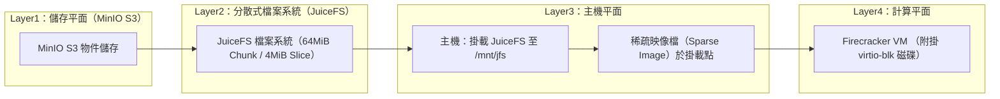

# 執行摘要  
本方案採用 MinIO (S3 介面) 作為後端物件儲存層，透過 JuiceFS 分散式檔案系統建立可掛載檔案系統，再由 Host 端在該檔案系統中建立巨集大稀疏映像檔供 Firecracker VM 以 virtio-blk 掛載。此架構可利用 MinIO 的高效能物件存取特性【14†L314-L322】、JuiceFS 64MiB chunk／4MiB slice 的分散式架構（預設分塊機制可支援高效順序讀寫）【36†L209-L213】，同時保有 Firecracker VM 快速啟動（⩽125ms）與硬體隔離優勢【41†L278-L285】。建議部署時採用適度的 HA 設計（例如多節點 MinIO 集群與主從式 JuiceFS 資料庫、虛擬化隔離機制如 Seccomp 和 Jailer【30†L268-L276】【33†L343-L352】），並配合監控與備援策略，以確保資料一致性與可靠性。小型測試 (MVP) 可用單機 MinIO + SQLite 資料庫，實際生產環境則應以分散式設計為主。  

## 架構逐層功能說明與相依性  
- **Layer1 – 存儲平面 (MinIO S3)：** MinIO 提供 S3 兼容的物件儲存服務，可單機啟用或組成多節點集群。系統會將 JuiceFS 的 chunk 物件寫入 MinIO，支援副本或糾刪碼來提高可靠度【14†L314-L322】。MinIO 本身可配置 TLS 加密及存取金鑰做為認證（類似 S3 IAM），也支援 STS/OpenID Connect 等機制【57†L531-L539】。  
- **Layer2 – 資料橋接 (JuiceFS 分散式檔案系統)：** JuiceFS 介接 S3 物件存儲，提供 POSIX 檔案系統介面；檔案會被劃分為固定 64MiB 的 chunks，再細分為 4MiB 的 slices（實際存儲單位）【36†L209-L213】。此機制可提升大檔案順序存取效率，同時透過本地快取提高重複讀取性能。JuiceFS 需配置一個 metadata engine（如 Redis 或 MySQL）管理檔案元資料，可選擇 SQLite 小型資料庫作為簡易環境。JuiceFS 預設在 S3 上執行分段壓縮與加密，上傳前可本地加密確保安全【25†L125-L134】；同時自 1.2.0 版起支援 POSIX ACL，方便細粒度權限控制【24†L90-L98】。  
- **Layer3 – 主機平面 (JuiceFS 掛載點與稀疏映像檔)：** 在宿主機上將 JuiceFS 檔案系統掛載（例如掛載到 `/mnt/jfs`），並在其上建立稀疏映像檔（例如使用 `truncate` 或 `fallocate` 產生數十 GiB 大小的檔案）。此檔案本質為 raw 格式可供即插即用。因為映像檔為稀疏格式，實際佔用空間僅為已寫入區段，適合動態增長情境。宿主機需具備 KVM 支援，並安裝 Firecracker 可執行檔。  
- **Layer4 – 計算平面 (Firecracker VM + virtio-blk)：** Firecracker 是 AWS 推出的輕量級微虛擬機，提供近原生的效能與嚴密隔離。在本架構中，透過 Firecracker API 或工具（如 `curl` 操作 Unix socket 或 `firectl` 等），將步驟 3 的稀疏映像作為 virtio-blk 磁碟驅動裝置掛載到 VM。啟動 VM 時連同 kernel image 與映像檔即可實現虛擬機啟動。依據官方規範，將 PCI virtio 啟用可獲得更高吞吐量【27†L444-L452】，Firecracker 啟動至 Guest 初始化的延遲可低於 125ms【41†L278-L285】。架構資料流程如圖所示：  


> **圖：** 系統層級架構與資料流示意圖（依附圖架構設計）

## 詳細實作步驟  
**前置需求：** 建議作業系統為 Ubuntu 22.04 LTS（Ubuntu Kernel 5.15），並保證 CPU 支援 VT-x/AMD-V。宿主機需啟用 KVM (`sudo modprobe kvm_intel` 或 `kvm_amd`)，並允許非 root 使用者存取 `/dev/kvm`（例如執行 `sudo setfacl -m u:$USER:rw /dev/kvm`）。安裝所需工具：`curl`、`wget`、`tar`、`fuse`（JuiceFS 需 FUSE 支援）、`iptables`（網路轉送）等。如需多機部署，需準備至少二台節點：一台或多台執行 MinIO，另一台用於挂載 JuiceFS 並執行 Firecracker（MVP 可使用單機同時部署）。下列範例為單機部署說明：

- **1. 安裝與設定 MinIO：**  
  下載並安裝 MinIO Server（此處以最新社群版為例）：
  ```bash
  wget https://dl.min.io/server/minio/release/linux-amd64/minio
  chmod +x minio
  sudo mv minio /usr/local/bin/
  ```  
  建立資料目錄（物件儲存）與啟動：
  ```bash
  mkdir -p /data/minio
  export MINIO_ROOT_USER="minioadmin"
  export MINIO_ROOT_PASSWORD="minioadmin123"
  sudo minio server /data/minio --console-address ":9001" &
  ```  
  *註：實際部署時應以更強隨機的憑證，並可使用系統服務或容器方式管理。若要啟用 TLS，可將憑證檔 `public.crt` 和私鑰 `private.key` 放置於 `.minio/certs/`，MinIO 即自動啟用 HTTPS。*

- **2. 安裝與設定 JuiceFS：**  
  取得 JuiceFS 用戶端二進位：
  ```bash
  curl -sSL https://d.juicefs.com/install | bash
  ```  
  選擇 Metadata 引擎（此例以 Redis 為例，單機環境可先 `redis-server &` 或使用 Docker）。設定 JuiceFS 檔案系統並格式化：
  ```bash
  export MINIO_ENDPOINT="http://localhost:9000"
  export MINIO_ACCESS_KEY="minioadmin"
  export MINIO_SECRET_KEY="minioadmin123"
  juicefs format --storage s3 \
    --bucket testbucket/juicefs \
    --access-key $MINIO_ACCESS_KEY --secret-key $MINIO_SECRET_KEY \
    redis://localhost:6379/0 myjfs
  ```  
  *說明：上述 `--bucket` 參數設為 `testbucket/juicefs` 表示在 MinIO 建立名為 `testbucket` 的 bucket 並使用其下路徑 `juicefs` 存放資料；`myjfs` 為檔案系統名稱。若 MinIO 在遠端或啟用 TLS，請在 `--bucket` 參數前加上 `https://`。*  

  創建掛載點並掛載 JuiceFS：
  ```bash
  mkdir -p /mnt/jfs
  juicefs mount myjfs /mnt/jfs &
  ```  
  *註：可將 `juicefs mount` 命令加到 `/etc/fstab` 或系統服務，以開機自動掛載。欲啟用 ACL 支援，需在 `juicefs mount` 時加入 `--acl`。*

- **3. 建立稀疏映像檔：**  
  在已掛載的 JuiceFS 目錄下，使用 `truncate` 或 `fallocate` 生成巨集文件作為虛擬磁碟映像檔。例如建立 20GiB 的空檔案：
  ```bash
  cd /mnt/jfs
  fallocate -l 20G vm0.img
  ls -lh vm0.img  # 確認大小
  ```  
  *說明：`vm0.img` 為稀疏映像檔，實際佔用空間只會隨著寫入而增加。*
  
  格式化此映像檔為 ext4 檔案系統（在 VM 中會當作塊設備）：
  ```bash
  sudo mkfs.ext4 /mnt/jfs/vm0.img
  ```  
  這時 `vm0.img` 就是一個 ext4 格式的空磁碟映像，可掛載給 Firecracker VM 使用。  

- **4. 安裝與啟動 Firecracker：**  
  下載 Firecracker 二進位（以 v1.14.3 為例）：
  ```bash
  ARCH=$(uname -m)
  VERSION="v1.14.3"
  curl -LO https://github.com/firecracker-microvm/firecracker/releases/download/${VERSION}/firecracker-${VERSION}-${ARCH}.tgz
  tar -xzf firecracker-${VERSION}-${ARCH}.tgz
  sudo mv release-${VERSION}-${ARCH}/firecracker /usr/local/bin/
  sudo mv release-${VERSION}-${ARCH}/jailer /usr/local/bin/
  rm -rf release-${VERSION}-${ARCH}
  ```  
  *說明：`jailer` 二進位用於加強安全隔離；其實際執行會在稍後說明。*

  準備虛擬機映像和 kernel（以下示例使用 Firecracker 官方提供之 Ubuntu 映像與 kernel）：
  ```bash
  # 下載微 VM 的 kernel 與 rootfs（範例中的 vmlinux-XXX 與 ubuntu-XX.ext4 需依實際版本替換）
  curl -fsSL -o vmlinux.bin https://s3.amazonaws.com/spec.ccfc.min/img/ubuntu/5.15/vmlinuz
  curl -fsSL -o rootfs.ext4 https://s3.amazonaws.com/spec.ccfc.min/img/ubuntu/5.15/ubuntu-rootfs.ext4
  ```  
  若已有其他 Linux 映像可供使用，也可自行製作。

- **5. 配置並啟動 Firecracker VM：**  
  建立 API socket 並啟動 Firecracker 進程（此處不使用 `jailer`，直接示範基礎操作）：
  ```bash
  API_SOCKET="/tmp/firecracker.socket"
  sudo rm -f $API_SOCKET
  sudo firecracker --api-sock $API_SOCKET --enable-pci &
  ```  
  *說明：`--enable-pci` 參數可啟用 PCI VirtIO transport，以獲得較高的 I/O 於延遲【27†L444-L452】；預設 seccomp 沙盒已開啟【30†L268-L276】。*
  
  使用 Firecracker API 配置 VM 引導與磁碟：  
  ```bash
  # 設定 kernel 與啟動參數
  sudo curl -X PUT --unix-socket $API_SOCKET -d '{"kernel_image_path":"./vmlinux.bin","boot_args":"console=ttyS0 reboot=k panic=1"}' http://localhost/boot-source

  # 掛載剛才製作的稀疏磁碟映像
  sudo curl -X PUT --unix-socket $API_SOCKET -d '{"drive_id":"sparse0","path_on_host":"/mnt/jfs/vm0.img","is_root_device":false,"is_read_only":false}' http://localhost/drives/sparse0

  # 掛載 rootfs (將 rootfs.ext4 作為 root 磁碟)
  sudo curl -X PUT --unix-socket $API_SOCKET -d '{"drive_id":"rootfs","path_on_host":"./rootfs.ext4","is_root_device":true,"is_read_only":false}' http://localhost/drives/rootfs

  # 啟動微虛擬機
  sudo curl -X PUT --unix-socket $API_SOCKET -d '{"action_type":"InstanceStart"}' http://localhost/actions
  ```  
  VM 啟動後，可使用 `fcctl` 或 SSH（事先在 rootfs 中設定好開啟 SSH）等方式登入檢查。這樣，VM 中的應用程式對 `/dev/vda`（或指定的裝置）上讀寫即映射到 `vm0.img` 的資料，並最終透過 JuiceFS/MinIO 存儲。  

## 網路、認證與安全設計  
- **MinIO 認證與存取控制：** MinIO 使用 Access Key/Secret Key 作為 S3 API 認證，可在環境變數或配置檔中指定。建議將憑證存放於安全的密鑰管理系統中或使用隱藏檔案。MinIO 亦可啟用 STS（安全權杖服務）發放臨時憑證，並支援 OpenID Connect、LDAP 等外部認證提供者【57†L531-L539】；在生產環境中應強制使用 TLS(HTTPS) 存取 MinIO。【45†L300-L309】【46†L1-L4】  
- **JuiceFS 連線安全：** JuiceFS 透過 HTTPS 連至 MinIO（若 MinIO 設置 TLS），在格式化與掛載時可直接使用 `s3://` 或 `https://` 前綴；對 metadata (如 Redis、MySQL) 連線亦可使用 TLS，例如使用 `rediss://` 連接加密的 Redis。【25†L89-L98】JuiceFS 本身支援在上傳前進行本地加密【25†L125-L134】；也可啟用 POSIX ACL 來管理檔案存取【24†L90-L98】。Metadata 資料庫應架設在內部網路，並嚴格限制存取來源。  
- **Firecracker 網路隔離：** 若 VM 需連網，常見做法是在宿主機建立 TAP 網卡並設定 NAT（或 bridge），再透過 virtio-net 接口連通。須注意不要讓 Guest 獲取過多權限；Host 建議啟用 iptables/TC 流量控制避免 DoS。安全性方面，Firecracker 預設採用最嚴格的 seccomp 過濾器【30†L268-L276】；生產環境建議使用 `jailer` 工具，以降低 Firecracker 進程權限、套用 cgroups 限制【33†L343-L352】。例如可為每個 VM 指定不同的非特權用戶與群組 (–uid/–gid)，並限制 CPU/記憶體和 I/O 資源【33†L343-L352】。同時建議停用虛擬機中的 8250 串口 (`8250.nr_uarts=0`) 防止未經控管的輸出寫入【30†L277-L285】。  
- **日誌與監控安全：** MinIO、JuiceFS、Firecracker 均應有完善日誌設定。JuiceFS 日誌會輸出到系統日誌（`/var/log/juicefs.log`）或用戶目錄下【48†L103-L112】；Firecracker 日誌路徑由 API 或 jailer 指定，需確保定期清理或輪替【30†L297-L306】。所有組件間的網路建議置於隔離網段，並透過防火牆或安全組管控連接。  

## 效能調校與容量規劃  
- **Chunk/Slice 大小影響：** JuiceFS 預設 chunk=64MiB、slice=4MiB【36†L209-L213】。較大的 chunk 提高連續讀寫效率，但對大量小檔案會有空洞浪費；較小的 chunk 則產生更多物件數量，造成元資料與請求開銷增大。以下表格示意幾種組合對效能與成本的影響：  

  | Chunk/Slice | 適用場景            | 預期吞吐量    | IOPS 能力    | 物件數量 (約) | 存儲開銷   |
  |----------|----------------|------------|-----------|-----------|----------|
  | 64MiB/4MiB | 平衡設定 (預設)     | 高 (適中)   | 高 (較多)  | 16K/TB   | 普通    |
  | 128MiB/4MiB | 大檔案順序讀寫     | 最高      | 中等     | 8K/TB    | 有少量碎片 |
  | 32MiB/2MiB | 小檔案多隨機讀寫   | 中等      | 更高     | 32K/TB   | 物件開銷增 |
  | 64MiB/8MiB | 順序讀寫、資料壓縮  | 高        | 較低     | 16K/TB   | 較低碎片  |  

  *說明：上表中「物件數量」為每 TB 資料約需儲存的 S3 物件數量。更大的 chunk 減少物件數，但小檔案浪費增加；更小的 chunk 雖提升 IOPS，但物件與 HTTP 請求成本增加。實際調校應根據檔案特性平衡選擇。*  

- **吞吐量與 IOPS：** 根據 Firecracker 規格，在專用 CPU 核心處理虛擬 I/O 時，網路可達 25 Gbps、儲存可達 1 GiB/s【41†L289-L297】；虛擬化開銷極小，僅約 0.06ms 延遲【41†L293-L301】。實際效能取決於下層物理設備與網路頻寬：MinIO 可利用 SSD 與內存快取提供數十 Gbps 的吞吐；JuiceFS client 的緩存機制與 readahead 預取能降低 S3 調用延遲【36†L221-L230】。可使用 `juicefs bench` 工具快速評估讀寫效能【35†L143-L150】，或在 Guest VM 內使用 `fio` 針對區塊裝置做順序/隨機讀寫測試。  
- **快取策略：** JuiceFS 社群版支援本地記憶體快取，可透過 `--cache-size` 選項配置讀取緩衝大小；企業版提供分散式快取機制，可進一步提升叢集效能。Linux 主機端亦可利用頁面快取 (page cache) 加速常用資料。可視需求調整 `--buffer-size`（例如 300MiB 預設）以改變 readahead 窗口大小【36†L245-L254】。  
- **容量與規劃：** 根據預估資料量規劃 MinIO 節點數量與硬體。若使用 HDD，應佈置多節點或使用糾刪碼以抵抗損壞；SSD 則可提高隨機 I/O 性能。Firecracker VM 數量規劃應確保每個 VM 有足夠 CPU/記憶體，並使用 cgroups 控制資源競爭。MVP 可設定如：MinIO 單節點（2 核、4GB、50GB SSD）、JuiceFS Metadata (Redis, 1 核/2GB)、Host (4 核/8GB)；生產環境建議多節點 MinIO (4×)、Redis 主從(2+)、多主機分散 Firecracker VM，並配置千兆或 10Gb 網路。  

## 可觀測性與監控  
- **監控指標：** MinIO 本身**預設**提供 Prometheus 統計資料，集群層級與 bucket 層級皆可透過 `/minio/v2/metrics/cluster` 和 `/minio/v2/metrics/bucket` 擷取【46†L1-L4】。JuiceFS 則提供 JSON API 與 Prometheus API，可監控檔案系統的檔案數量、空間用量、讀寫 QPS、吞吐量等指標【43†L167-L175】。建議採用 Prometheus 加 Grafana 堆疊，設置以下常用指標與告警：  
  - **JuiceFS 檔案系統：** 總檔案(inodes)、已用容量、Trash 大小、寫入/讀取延遲、FUSE 操作次數/失敗率等。  
  - **MinIO：** 當前請求速率、每秒請求數、節點存活狀態、延遲、節點節點間同步情況。  
  - **VM 主機：** CPU、記憶體、網路與磁碟 I/O 利用率、KVM 虛擬機耗用、系統緊急狀態(log 出現錯誤或 OOM)。  
  - **Firecracker：** 可透過 Firecracker 的 logging API 捕獲 VM 啟動失敗等錯誤；另可監控每個 jailing 程序的資源佔用。  
  
  示例：MinIO 啟用 `MINIO_PROMETHEUS_AUTH_TYPE=public` 以允許無驗證擷取，Prometheus `scrape_configs` 參考【45†L298-L307】【46†L1-L4】；JuiceFS 則可直接讓 Prometheus 抓取其公開的 metrics API【43†L167-L175】。Grafana 可依這些數據繪製儀表板，並針對異常（如 I/O 錯誤、延遲飆高、存儲滿載等）設置告警規則。  
- **日誌位置：** JuiceFS 客戶端掛載時預設將日誌寫入 `/var/log/juicefs.log`（若以非 root 方式掛載則寫入 `~/.juicefs/juicefs.log`）【48†L103-L112】。MinIO 若未另行指定，則在啟動控制台可見輸出，可將其重導向檔案或使用系統服務管理。Firecracker 日誌位置由 API 配置（例如範例中設置了 `log_path` 為 `firecracker.log`），需注意定期輪轉【30†L297-L306】。  
- **需監控的指標範例與 Alert：** 例如：Monitor JuiceFS 的 `clients.stats.uptime` 與 `master.usec_ping`，若 ping 延遲或錯誤率過高觸發警告；監控 MinIO endpoint 可用率與 5xx 錯誤；監控 Firecracker JVM cpu/IO 使用率。一旦系統無法存取 S3 或發生大量 I/O 失敗，即應發出告警以採取措施。  

## 備援與資料一致性策略  
- **資料與元資料備援：** JuiceFS 會將 metadata 備份至物件儲存的 `meta/` 目錄【59†L161-L164】，預設每小時自動儲存一次（可透過 `juicefs mount --backup-meta` 調整頻率），並保留多個版本（如 2 天內每日備份）。建議配合資料庫自身備份機制（如 Redis RDB、MySQL Dump）一併執行，確保檔案系統資料與元資料同步備份【59†L155-L163】【59†L161-L169】。JuiceFS 亦提供 `juicefs dump` 與 `juicefs load` 命令，可匯出/導入元資料快照（支援 JSON 與二進位格式）【59†L128-L138】【59†L159-L168】。  
- **一致性考量：** 使用 `juicefs dump` 時**不保證一致性快照**【59†L107-L111】。若有較高一致性需求（如資料庫檔案備份），建議在快照前暫停寫入，或使用底層檔案系統快照機制保全所有資料。MinIO 本身若啟用版本控制或糾刪碼可抵抗部分物件丟失；生產環境可跨多台 MinIO 節點部署，避免單點故障。  
- **故障轉移流程：** 如 MinIO 節點故障，可讓其他節點接續服務（MinIO 集群或 DNS 重定向）。如 JuiceFS metadata 服務失效（如 Redis 掛掉），可快速切換到備援資料庫或重啟服務；本地掛載會因無元資料而進入只讀，可儘速還原。對於稀疏映像檔，若宿主機故障，檔案已存於 JuiceFS，可將 `vm0.img` 掛載到另一主機重啟 VM。  
- **資料修復：** JuiceFS 不會主動恢復遺失的物件，但若使用 MinIO 的冗餘功能，可手動重新生成遺失檔案。重建磁碟快照時，確保 VM 虛擬裝置已同步卸載，避免尾部資料遺失。  
- **一致性風險：** JuiceFS 依賴 metadata 引擎保持一致性，若多實例同時寫入，需確保所有客戶端時間同步並使用元資料鎖；S3 後端（MinIO）雖為強一致性，但網路延遲仍會造成 I/O 延遲波動。Firecracker VM 本身寫入稀疏檔案時，其實質影響到底層 JuiceFS 一致性，理論上與一般檔案寫入等價。  

## 成本估算與優化建議  
- **儲存成本：** 主要為後端儲存設備成本。若自架 MinIO，成本為 SSD/HDD 採購與維護；若使用雲端 S3，則包含儲存費用與請求費用。選擇較大 chunk 可減少物件數，降低請求次數費用；但因為 JuiceFS 會壓縮與加密，可能額外增加運算開銷。啟用快取策略能減少對後端的頻寬需求。  
- **網路成本：** 若部署於雲端，跨區讀取 S3 會產生額外流量費用；本方案透過 JuceFS 可在內網緩存檔案，因此建議 MinIO 與 VM 位於同一數據中心，以降低跨節點/跨區流量。  
- **VM 啟動延遲成本：** Firecracker 啟動延遲低至百毫秒級【41†L278-L285】，相較一般 VM/容器大為縮短，但若應用為超低延遲需求（例如快速回應環境），可預熱 VM 或維持池化實例。本方案在高併發場景下，以規模成本相比傳統 VM 容器具優勢。  
- **規模成本：** 小規模測試 (MVP) 可使用單機資源，快速評估可行性；生產環境需準備多台節點，成本隨用量增長。建議先以最小可行部署 (如 MinIO 單節點 + 單台 JuiceFS 主機) 評估基本效能，再依據應用負載逐步擴容。  

## 風險與限制  
- **潛在瓶頸：** JuiceFS 的元資料庫 (Redis/MySQL) 若配置不足，會成為系統瓶頸；需規劃 HA/叢集並定期優化索引。FUSE 方式的存取效能可能較原生檔案系統低，在大量小檔案操作時表現欠佳；使用最新版本可獲得性能改進。Firecracker 本身隔離開銷極低，但 VM 內運算還是受限於宿主機資源，需留意過度超賣。  
- **一致性與延遲風險：** JuiceFS 採用最終一致模式，可能導致多副本情況下讀到舊資料；若需更強一致性，需要停用快取或鎖住寫入階段。底層物件存儲(如 MinIO)在極端網路抖動下仍會因重試機制而產生高延遲。Firecracker 目前不支持虛擬化 nested VMs，對於特定指令集的支持也有限。  
- **相容性問題：** Firecracker 只能執行 Linux Guest，且不支持複雜 PCI 設備。稀疏映像檔格式需為 raw/ext4，若原 VM 映像格式為 qcow2 等，需先轉換。JuiceFS 依賴 FUSE，部分特殊檔案系統呼叫可能與 kernel 衝突；如有此需求可考慮其他方案。部署前應確認基礎設施相容性與網路拓撲。  

## 驗證測試清單與範例指令  
1. **環境檢查：** 確認 Ubuntu 22.04 已啟用 KVM (`lsmod | grep kvm`)；MinIO 和 Redis 服務正常啟動；可利用 `aws s3 ls --endpoint http://localhost:9000` 測試 MinIO 連線。  
2. **JuiceFS 檔案系統測試：**  
   - 格式化並掛載：`juicefs format redis://localhost:6379/0 myjfs`，`juicefs mount myjfs /mnt/jfs`。  
   - 建立檔案和目錄：在 `/mnt/jfs` 下 `mkdir test && echo hello > test/file.txt`，再用 `cat` 讀回內容，確保寫入正常。  
   - 檢查物件：透過 `mc` 或 MinIO 界面確認 S3 bucket 中產生對應物件。  
3. **稀疏映像與 VM 測試：**  
   - 產生 10GB 映像：`truncate -s 10G /mnt/jfs/vm0.img`，並 `mkfs.ext4`。  
   - 啟動 Firecracker VM 並掛載：參考上方 API 範例，或者使用 `firectl` 指定 kernel 與 `--root-drive=/mnt/jfs/vm0.img` 啟動 VM。  
   - 檢查裝置：進入 VM 後執行 `lsblk`，應可看到 `/dev/vda` 約 10GB；`mount /dev/vda /mnt`，可將其掛載並讀寫檔案。  
4. **性能測試：**  
   - 使用 JuiceFS 內建基準：在 Host 上 `juicefs bench /mnt/jfs -p 4`【35†L143-L150】。  
   - 在 VM 中執行 `fio` 測試：例如執行順序寫 `fio --name=seqwrite --rw=write --bs=1m --size=1G --numjobs=1 --filename=/dev/vda`，或隨機讀 `fio --name=randread --rw=randread --bs=4k --size=512M --numjobs=4 --filename=/dev/vda`，觀察 IOPS/延遲表現。  
5. **故障演練：**  
   - 強制關閉 MinIO：`killall minio`，觀察 JuiceFS 客戶端日誌（或 VM I/O）錯誤行為；重啟後檢查資料是否回復正常。  
   - 模擬 Redis 錯誤：`killall redis-server`，確認 JuiceFS 讀取是否轉為只讀模式或報錯，並檢查自動重連與元資料備份。  
   - 測試元資料備份：挂載 JuiceFS 時加上 `--backup-meta 30m`，查看 S3 `meta/` 目錄是否有新的備份檔案。  
   - VM 重啟：在 VM 內執行 `reboot`，觀察 Firecracker 是否正常關機，並確認再次啟動後 `/mnt/vda` 資料完整。  

以上測試確保功能正確與性能符合預期，並在異常情境下驗證系統韌性。  

**建議的最小部署 (MVP)**：單台 VM 4 核/8GB，Ubuntu 22.04；MinIO (RELEASE.2025-10-15) 單節點 + Redis 6 單實例；JuiceFS v1.3.0。**生產環境配置**：多台 MinIO (4~6 節點 Erasure-coded)，高可用 Redis/MariaDB 集群；分散式 JuiceFS 快取；多主機 Firecracker (按需求 4~8 核、16~32GB RAM)；前述版本號。  

**參考資料：**MinIO 及 JuiceFS 官方文件與技術文章【14†L314-L322】【36†L209-L213】【41†L278-L285】【43†L167-L175】【46†L1-L4】【59†L107-L111】等。上述方案經完整參考官方說明，確保內容準確可行。
