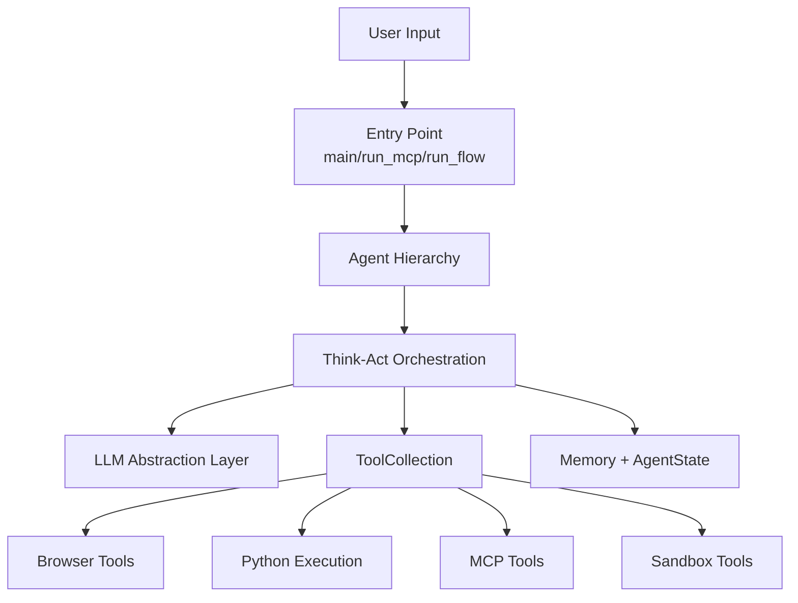
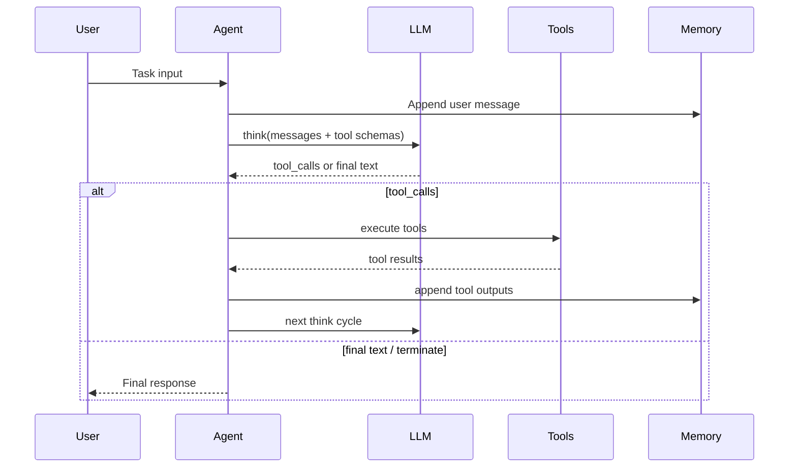

# FoundationAgents OpenManus 架構摘要

## 文件目的
- 目標：快速掌握 OpenManus 的「架構層」設計，尤其是 agent loop、tool system、LLM abstraction 與 MCP/sandbox 延伸能力。
- 範圍：聚焦系統分層、關鍵元件互動、可擴展點與風險。

## 資料來源
- GitHub: <https://github.com/FoundationAgents/OpenManus>
- README: <https://raw.githubusercontent.com/FoundationAgents/OpenManus/main/README.md>
- DeepWiki:
  - <https://deepwiki.com/FoundationAgents/OpenManus>
  - <https://deepwiki.com/FoundationAgents/OpenManus/1.2-system-architecture-overview>
  - <https://deepwiki.com/FoundationAgents/OpenManus/3-agent-architecture>

## 一句話定位
OpenManus 是一個「通用 agent framework」，用 think-act cycle 把 LLM 與工具鏈（browser、python、MCP、sandbox）整合，強調可擴充與多場景執行。

## Top-down 架構總覽
系統可分成六層：
1. **Entry Layer**：`main.py`、`run_mcp.py`、`run_flow.py` 三種執行入口。
2. **Agent Layer**：`BaseAgent -> ReActAgent -> ToolCallAgent -> specialized agents`。
3. **Orchestration Layer**：think/act/run loop、state、memory 管理。
4. **Tool Layer**：`BaseTool` + `ToolCollection` 插件式工具框架。
5. **LLM Layer**：多 provider 抽象（OpenAI/Azure/AWS Bedrock）。
6. **Integration Layer**：MCP（client/server）與 sandbox（例如 Daytona）整合。

## 核心元件與責任切分

### 1) Agent Hierarchy（核心骨架）
- `BaseAgent`：狀態管理、執行回圈、記憶體與 step 邏輯框架。
- `ToolCallAgent`：把 function calling 與工具執行整合進 think-act cycle。
- Specialized agents（如 `Manus`、`BrowserAgent`、`MCPAgent`、`DataAnalysis`）負責場景特化。

### 2) Think-Act Execution Model（行為核心）
- **Think**：LLM 根據 memory + tool schema 產生 tool calls 或文本回覆。
- **Act**：執行工具並把結果寫回 memory，供下一輪 reasoning。
- **Finish**：由 `Terminate` 或步數/狀態條件終止。

### 3) Tool System（可擴展能力層）
- 透過 `BaseTool` 規範輸入輸出與執行介面。
- `ToolCollection` 做註冊、查找、參數驗證、路由執行。
- 同一套框架承載 browser/web/crawl/python/file/shell/MCP/sandbox 等異質工具。

### 4) LLM Abstraction（模型供應商解耦）
- 統一 `LLM` 介面封裝不同 provider。
- 支援 token 計算與上下文限制控管。
- 可在不改 agent 主流程下替換模型供應商。

### 5) MCP Integration（外部能力匯流）
- OpenManus 可作為 MCP client 連接外部工具伺服器。
- 遠端工具會被包裝成可被 agent 呼叫的本地 tool abstraction。
- 適合把內部平台能力（DB、部署、知識庫）透過 MCP 暴露給 agent。

## 主要執行流程（單回圈）

## 架構優勢（你會感受到的）
- **模組化清楚**：agent、tool、LLM、config 分層明確，改動影響面可控。
- **擴展成本低**：新增 custom tool 或 custom agent 有標準介面可依循。
- **整合能力強**：MCP + sandbox 讓它可接企業內部工具與受限執行環境。
- **多入口模式**：可依任務型態選 `main`/`run_mcp`/`run_flow`。

## 架構風險與限制
- 若工具治理不足，agent 可能出現工具濫用或高成本迴圈。
- 多 provider + 多工具 + 多代理模式，除錯複雜度會快速上升。
- 專案起源為快速原型，正式上線前需補 observability、quota、guardrail。

## TO-DO List（建議下一步）
- [ ] 先鎖定單一 entry point（通常 `main.py`）做最小可行任務鏈。
- [ ] 設計你自己的 tool allowlist 與失敗重試策略。
- [ ] 把業務系統能力優先做成 MCP server，再逐步導入 agent。
- [ ] 對高成本工具（browser/crawl/python）加上 step/token/budget 限制。
- [ ] 建立標準化 telemetry（每回圈 token、tool latency、success rate）。

## 快速結論
OpenManus 的重點不是「安全隔離 runtime」，而是「通用 agent 編排框架」：它在可擴展性與工具整合很強，適合做任務自動化與多工具協作；但要上生產，必須額外補齊治理、監控與風險控制機制。
