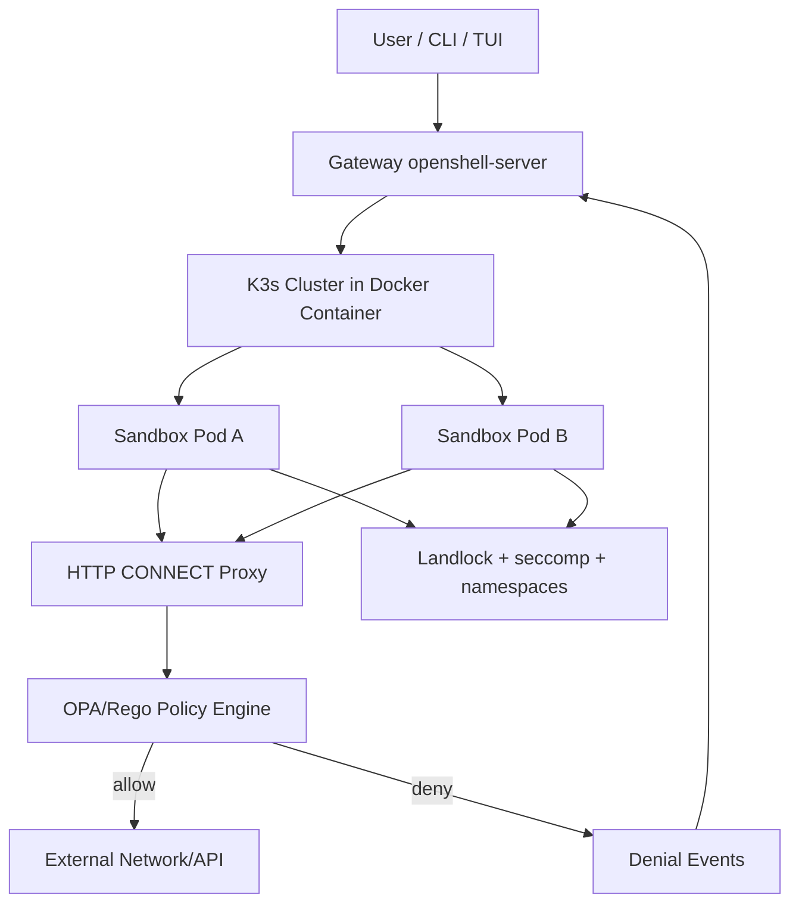
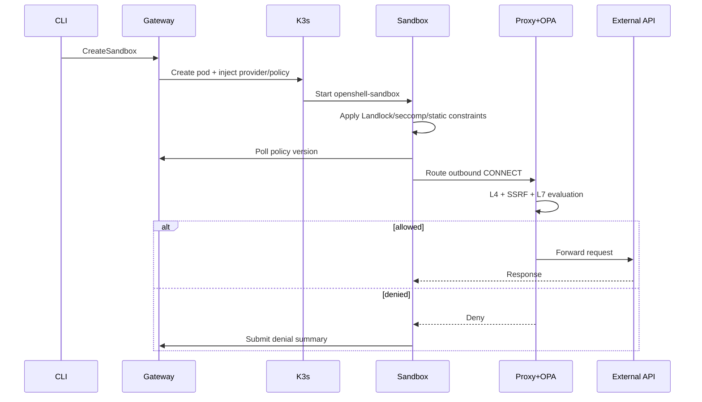

# NVIDIA OpenShell 架構摘要

## 文件目的
- 目標：用最短時間理解 OpenShell 的「架構層」設計與關鍵取捨。
- 範圍：聚焦 control plane / execution plane、policy enforcement、部署模型與資料流。

## 資料來源
- GitHub: <https://github.com/NVIDIA/OpenShell>
- README: <https://raw.githubusercontent.com/NVIDIA/OpenShell/main/README.md>
- DeepWiki:
  - <https://deepwiki.com/NVIDIA/OpenShell>
  - <https://deepwiki.com/NVIDIA/OpenShell/5-gateway-and-cluster-architecture>
  - <https://deepwiki.com/NVIDIA/OpenShell/12-architecture-reference>

## 一句話定位
OpenShell 是一個給 autonomous agent 使用的「安全執行 runtime」，把 agent 工作負載放進 sandbox，並透過多層 policy（filesystem/process/network/inference）做防護與可稽核治理。

## Top-down 架構總覽
OpenShell 主要分成四層：
1. **User Interface Layer**：`openshell` CLI 與 `openshell term` TUI。
2. **Control Plane**：Gateway（`openshell-server`）負責 sandbox lifecycle、policy 版本管理、log 收集。
3. **Execution Plane**：每個 sandbox 為獨立 pod/container 執行 agent 工作。
4. **Policy Enforcement Plane**：Kernel + userspace 的 defense-in-depth。

## 核心元件與責任切分

### 1) Gateway（控制平面）
- 提供 gRPC API（如 sandbox create/delete、policy update/get）。
- 維護 policy version 與狀態（pending/loaded/failed/superseded）。
- 接收 sandbox denial summary，支援 policy recommendation 流程。
- 聚合與保存運行期日誌。

### 2) Sandbox Supervisor（執行平面）
- 每個 sandbox 由 `openshell-sandbox` 監管。
- 在啟動時施加 static policy（Landlock、seccomp、權限降級）。
- 執行期由 HTTP CONNECT proxy + OPA 做動態 network/L7 判斷。
- 定期 poll gateway 取得新 policy（hot reload 動態規則）。

### 3) Policy Engine（安全策略中樞）
- 使用 OPA/Rego（Rust `regorus`）嵌入式評估。
- 支援 L4（目的地 + binary）與 L7（HTTP method/path）雙層判斷。
- 包含 SSRF 防護（DNS 解析 + private IP 檢查）。
- 將 deny 事件彙整後回傳 gateway 形成「策略修補建議」輸入。

### 4) Cluster Container（部署封裝）
- 把 K3s + Helm + supervisor binary 封進單一 Docker image。
- 以 side-loading 方式提供 supervisor binary，避免每次都重建 sandbox image。
- 本地/遠端/雲端三種拓樸共用同一套 CLI 操作語意。

## 重要架構決策（Architecture Decisions）
- **Cluster-in-container**：降低 K8s 安裝門檻，強化開發體驗。
- **Static vs Dynamic policy 分離**：
  - static（filesystem/process）啟動時鎖定，降低執行中升權風險。
  - dynamic（network/inference）可熱更新，提升運營靈活性。
- **Side-loading supervisor**：更新 sandbox 執行層不需重建全部社群映像。
- **gRPC + mTLS**：控制平面通訊採強型別 RPC + 雙向 TLS。

## 主要執行流程（建立 sandbox 到外連）

## 你要優先理解的 5 個重點
- OpenShell 的本質是「安全代理執行平台」，不是單純 agent framework。
- 安全性不只靠一層，從 kernel 到 L7 proxy 都有防護與審計。
- policy 的「可變與不可變」切分是整體安全/運維平衡核心。
- gateway 承擔 state 與 policy version 中樞，sandbox 盡量保持可替換。
- side-loading + fast deploy 代表它很重視「快速迭代執行層」。

## 導入/評估時的風險觀察
- 單節點 K3s-in-Docker 對生產多租戶仍屬早期定位（README 也標示 alpha）。
- mTLS、PKI、DNS/iptables 初始化流程較複雜，部署失敗點較多。
- network policy 設計品質直接影響可用性與安全性，治理流程要成熟。

## TO-DO List（建議下一步）
- [ ] 先跑 `openshell sandbox create` + `openshell policy set`，確認最小可行流程。
- [ ] 建一份你自身業務的「allowlist policy baseline」。
- [ ] 驗證關鍵外部 API 的 L7 method/path 規則是否足夠精細。
- [ ] 針對敏感資料流程演練 deny/allow 與審計（denial summary）回圈。
- [ ] 若要上 GPU，先完成 host driver + NVIDIA Container Toolkit 相容性檢查。

## 快速結論
若你在找的是「可控、可稽核、具安全邊界」的 agent runtime，OpenShell 架構方向很明確；但在 production 級多租戶與營運成熟度上，仍需要你自行補齊平台工程與治理流程。
